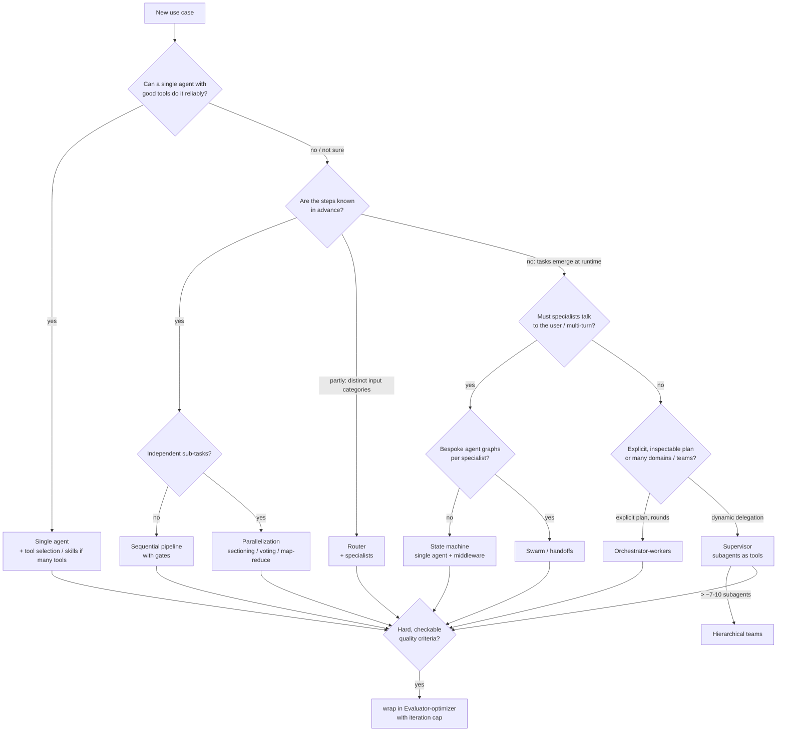

English | [Deutsch](de/README.md)

# Multi-agent patterns with LangGraph: summary

This folder documents what we built and what we learned. We researched the
common multi-agent patterns, implemented each one natively in LangGraph for the
same business use case (processing a customer-service inbox), measured them, and
packaged them into a reusable library (`agentpatterns`).

| Document | Content |
|---|---|
| **This page** | Summary, pattern overview, decision guide, recommendations |
| [use-case.md](use-case.md) | The e-mail use case, mock LLM and data, how to run, measured comparison |
| [patterns/](patterns/) | Detailed report per pattern (how it works, our implementation, trade-offs, when to use) |
| [library.md](library.md) | `agentpatterns`: design, API reference, integration guide |
| [sources.md](sources.md) | Research sources and quantitative claims |

The versions used are LangGraph 1.2, LangChain 1.4 and `langchain-core` 1.6 (September 2026).

---

## 1. The patterns at a glance

| # | Pattern | In one sentence | Who decides the control flow? | Report |
|---|---|---|---|---|
| 1 | **Single agent** | One tool-calling agent with all tools loops until done. | the model | [01](patterns/01-single-agent.md) |
| 2 | **Sequential pipeline** (prompt chaining) | A fixed chain of LLM calls and code steps with gates. | the graph (code) | [02](patterns/02-sequential-pipeline.md) |
| 3 | **Router** | One classification step dispatches to one or more specialists, then a synthesizer merges the results. | one LLM decision, then the graph | [03](patterns/03-router.md) |
| 4 | **Parallelization** | Independent branches run at the same time and are merged (sectioning, voting, map-reduce). | the graph | [04](patterns/04-parallelization.md) |
| 5 | **Orchestrator-workers** | An LLM plans tasks at runtime, workers run in parallel, and the planner can re-plan. | LLM plan + graph | [05](patterns/05-orchestrator-workers.md) |
| 6 | **Supervisor** (subagents as tools) | A main agent delegates to subagents through tool calls and composes the answer. | the supervisor model | [06](patterns/06-supervisor.md) |
| 7 | **Hierarchical teams** | Supervisors of supervisors. | models at each level | [07](patterns/07-hierarchical.md) |
| 8 | **Swarm / network** (handoffs) | Peer agents hand control to each other, with no coordinator. | the currently active model | [08](patterns/08-swarm-handoffs.md) |
| 9 | **State machine** (handoffs in one agent) | One agent whose prompt and tools change per step through middleware. | model inside code-defined states | [09](patterns/09-state-machine.md) |
| 10 | **Skills** (progressive disclosure) | One agent loads specialized instructions and tools on demand. | the model | [10](patterns/10-skills.md) |
| 11 | **Evaluator-optimizer** (reflection) | A generator and an evaluator loop until the output passes the criteria. | evaluator verdict + cap | [11](patterns/11-evaluator-optimizer.md) |
| + | Blackboard, group chat / debate, plan-and-execute variants, Deep Agents | Covered briefly. | | [12](patterns/12-other-patterns.md) |

Patterns 1-5 and 11 appear in Anthropic's "Building effective agents" as the
basic *workflow* and *agent* patterns. Patterns 6, 8, 9 and 10 correspond to the
LangChain v1 multi-agent patterns (Subagents, Handoffs, Skills, Router, Custom
workflow). Pattern 7 is the nested form of 6.

## 2. Comparison

| Pattern | Model calls: 1-intent / 2-intent / spam* | Parallel work | Context isolation | Talks to the user directly | Determinism / auditability | Main risk |
|---|---|---|---|---|---|---|
| Single agent | 3 / 3 / 1 | parallel tool calls only | none | yes | low | tool overload, context bloat |
| Sequential pipeline | 4 / 4 / 1 | no | per step | no | **high** | rigid; early errors propagate |
| Router | 5 / 8 / 2 | **yes** | per route | no (stateless) | medium-high | misrouting is final |
| Parallelization | 7 / 7 / 4 | **yes** | per branch | no | high | cost multiplies with branches |
| Orchestrator-workers | 10 / 10 / 2 | **yes** | per task | no | medium (plan is inspectable) | planner quality, latency of rounds |
| Supervisor | 5 / 8 / 1 | **yes** (parallel tool calls) | **strong** | only the supervisor | medium | "telephone game", extra hop |
| Hierarchical | 7 / 10 / 1 | yes | strong | only the top level | low-medium | latency, summarization loss per level |
| Swarm | 4 / 7 / 1 | no (sequential) | weak (shared history) | **yes** | low | handoff loops, context growth |
| State machine | 6 / 6 / 3 | parallel tool calls | step-scoped tools | **yes** | **high** (order enforced) | more calls for transitions |
| Skills | 4 / 4 / 1 | parallel tool calls | none (skills stay in context) | **yes** | low-medium | token growth after loading |
| Evaluator-optimizer | 6 / 6 / 2 (1 revision) | no | generator vs judge | no | medium | non-converging loops |

\* Measured in our e-mail use case with the scripted mock LLM (E-1001 / E-1004 /
E-1005). The counts come from each pattern's control flow and are exact. Answer
quality is **not** compared: the mock is deterministic, so every pattern
produces the same reply (see [use-case.md](use-case.md#measured-comparison)).

## 3. Decision guide

| If you need... | Use |
|---|---|
| One domain, fewer than ~10-15 distinct tools | **Single agent** (plus `LLMToolSelectorMiddleware` or skills when tools grow) |
| Fixed, auditable business process; compliance; cheap models per step | **Sequential pipeline** / custom workflow |
| Clear input categories with large per-domain context | **Router** (wrap it as a tool for chat) |
| Independent analyses, guardrails running beside the main task, batch jobs | **Parallelization** |
| Work whose sub-tasks depend on intermediate results (research first, then act) | **Orchestrator-workers** with `max_rounds > 1` |
| Many domains, central control, subagents owned by different teams, third-party agents | **Supervisor** |
| More subagents than one supervisor can route reliably | **Hierarchical teams** (or flatten first) |
| Multi-turn conversations where the "who" changes (triage to specialist) | **State machine** (default), **swarm** if each agent is a custom graph |
| Many specializations, but one agent is enough | **Skills** |
| A measurable quality bar (policy, format, tests) | **Evaluator-optimizer** around any of the above |

## 4. Recommendations (our opinion, based on the research and the experiments)

1. **Start simple and measure.** Anthropic, OpenAI, Microsoft and LangChain all
   give the same advice first: maximize a single agent, and add agents only when
   you hit a concrete limit (tool confusion, context size, team boundaries,
   parallelism). In our use case the single agent needed the fewest model calls
   (16 for the whole inbox). With a real model its weakness would be reliability
   once the tool count and the prompt grow, not cost.
2. **Keep business processes as workflows and use agents inside the steps.**
   E-mail triage has known phases (classify, research, act, reply, check). A
   graph gives you gates, audit trails and places for human approval. Put
   agentic freedom inside nodes where it pays off. This is LangChain's "custom
   workflow" pattern and Anthropic's "workflows before agents" advice.
3. **Irreversible side effects belong in code or behind approval.** In every
   workflow the model only *proposes* the reply; a deterministic `dispatch`
   node sends it. Tools enforce policy themselves (refund limit, idempotency).
   The composite example adds an `interrupt()` approval step.
4. **The supervisor with subagents as tools is the default multi-agent
   pattern.** It is flexible, isolates context, calls subagents in parallel, and
   is what the LangChain docs now recommend (`langgraph-supervisor` is
   unmaintained). Watch the extra hop: return structured reports from
   subagents so that the supervisor doesn't have to rephrase them.
5. **Use handoffs for conversations, not for back-office pipelines.** Handoffs
   pay off when the user talks to the specialist over several turns. Prefer the
   single-agent state machine; use a swarm only when agents are really
   different graphs. In a batch process a swarm is sequential and its context
   keeps growing: E-1004 had the highest token use (about 11k) of all patterns
   in our run.
6. **Skills are the cheapest route to many specializations.** Skills needed 4
   calls even for the multi-intent e-mail. The trade-off is that loaded skills
   stay in context.
7. **Always cap loops.** Evaluator loops, re-planning and handoffs each get an
   explicit limit (`max_iterations`, `max_rounds`, `max_handoffs`), every agent
   loop gets `max_model_calls`, and single participants can be capped
   (`max_calls_per_agent`, `max_activations`, `max_visits`). Limits are counted
   per agent run, so they multiply in nested systems; `RunBudget` caps a whole
   run. LangGraph's default recursion limit (10,007 super-steps in 1.2) is not a
   safety net. See [Limits and budgets](library.md#limits-and-budgets).
8. **Compose patterns.** Real systems mix patterns: parallel triage, a spam
   gate, a router to specialists, a quality loop, human approval, and
   map-reduce over the inbox. Our [composite example](library.md#composition)
   builds exactly that in about 60 lines because every pattern follows the same
   agent contract.

## 5. Cross-cutting lessons

- **Context engineering decides quality.** For each pattern, decide what each
  agent sees: the task only (isolated) or the history (forked), a full or a
  summarized handoff, and a structured report or raw messages.
- **Structured output everywhere.** Routing decisions, plans, reports,
  verdicts and the final resolution are Pydantic models (`response_format` /
  `with_structured_output`). They are validated, testable and easy to pass
  between agents.
- **Name and describe agents carefully.** Names and descriptions are what
  supervisors and routers route on.
- **Messages between agents are a side channel, not a pattern.**
  `MessagingMiddleware` lets the agents of one run message each other. That
  helps agents that run at the same time (parallel branches, map-reduce,
  orchestrator workers). Everywhere else the patterns' own data flow (step
  outputs, handoff notes, tool results) is clearer. See
  [Messaging between agents](library.md#messaging-between-agents).
- **Test with scripted models.** `agentpatterns.testing.ScriptedChatModel`
  simulates a tool-calling LLM from a policy function. It is deterministic even
  with parallel branches, so the orchestration can be unit-tested without API
  calls.
- **Observe.** The `UsageTracker` callback counts model calls and tokens per
  agent; in production use LangSmith or OpenTelemetry tracing.
