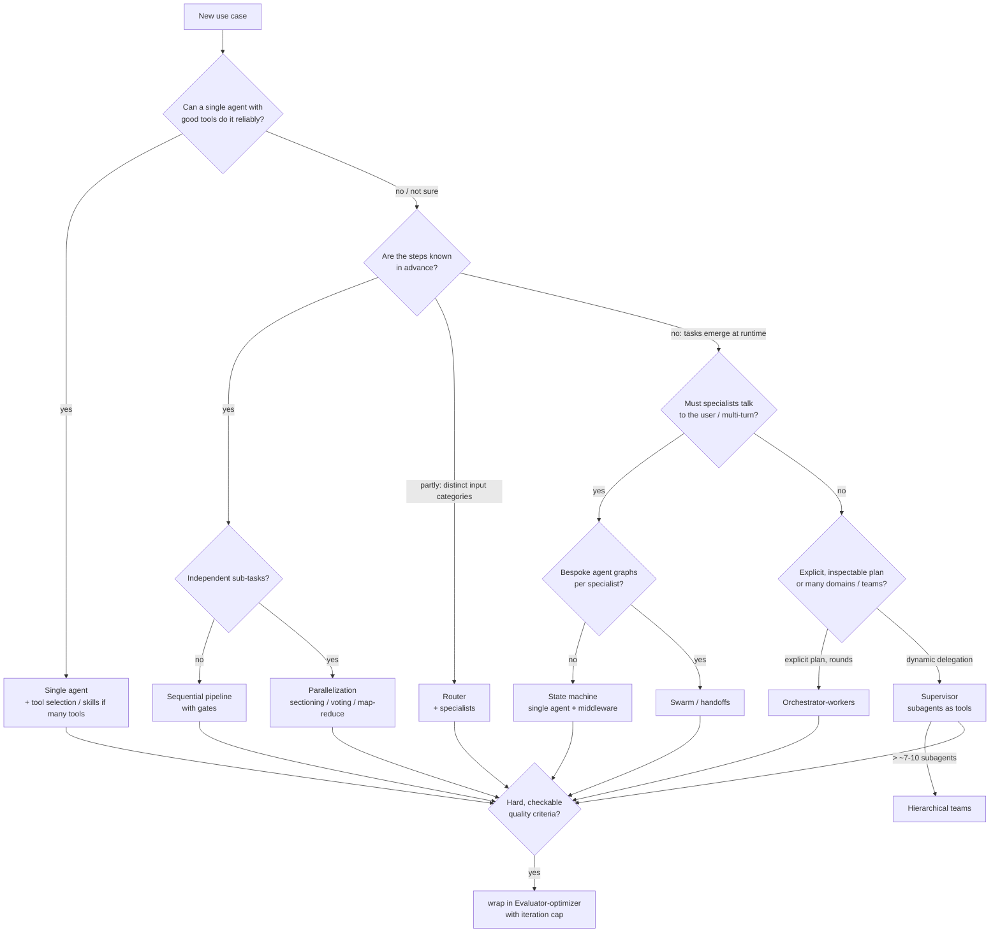

[English](../README.md) | Deutsch

# Multi-Agent-Patterns mit LangGraph: Zusammenfassung

Dieser Ordner dokumentiert, was wir gebaut und was wir dabei gelernt haben. Wir
haben die gängigen Multi-Agent-Patterns recherchiert und jedes davon nativ in
LangGraph für denselben geschäftlichen Anwendungsfall umgesetzt: die Bearbeitung
eines Kundenservice-Posteingangs. Anschließend haben wir die Patterns gemessen
und in einer wiederverwendbaren Bibliothek (`agentpatterns`) gebündelt.

| Dokument | Inhalt |
|---|---|
| **Diese Seite** | Zusammenfassung, Überblick über die Patterns, Entscheidungshilfe, Empfehlungen |
| [use-case.md](use-case.md) | Der E-Mail-Anwendungsfall, Mock-LLM und Daten, Ausführung, gemessener Vergleich |
| [patterns/](patterns/) | Ausführlicher Bericht pro Pattern (Funktionsweise, unsere Implementierung, Vor- und Nachteile, Einsatzgebiete) |
| [library.md](library.md) | `agentpatterns`: Design, API-Referenz, Integrationsleitfaden |
| [sources.md](sources.md) | Recherchequellen und quantitative Aussagen |

Verwendet werden LangGraph 1.2, LangChain 1.4 und `langchain-core` 1.6 (Stand: September 2026).

---

## 1. Die Patterns im Überblick

| # | Pattern | In einem Satz | Wer bestimmt den Kontrollfluss? | Bericht |
|---|---|---|---|---|
| 1 | **Single Agent** | Ein Tool-aufrufender Agent mit allen Tools arbeitet in einer Schleife, bis er fertig ist. | das Modell | [01](patterns/01-single-agent.md) |
| 2 | **Sequenzielle Pipeline** (Prompt Chaining) | Eine feste Kette aus LLM-Aufrufen und Code-Schritten mit Gates. | der Graph (Code) | [02](patterns/02-sequential-pipeline.md) |
| 3 | **Router** | Ein Klassifikationsschritt verteilt an einen oder mehrere Spezialisten, danach führt ein Synthesizer die Ergebnisse zusammen. | eine LLM-Entscheidung, danach der Graph | [03](patterns/03-router.md) |
| 4 | **Parallelisierung** | Unabhängige Zweige laufen gleichzeitig und werden zusammengeführt (Sectioning, Voting, Map-Reduce). | der Graph | [04](patterns/04-parallelization.md) |
| 5 | **Orchestrator-Worker** | Ein LLM plant Aufgaben zur Laufzeit, Worker arbeiten parallel, und der Planer kann neu planen. | LLM-Plan + Graph | [05](patterns/05-orchestrator-workers.md) |
| 6 | **Supervisor** (Subagenten als Tools) | Ein Haupt-Agent delegiert per Tool-Aufruf an Subagenten und stellt die Antwort zusammen. | das Supervisor-Modell | [06](patterns/06-supervisor.md) |
| 7 | **Hierarchische Teams** | Supervisoren von Supervisoren. | Modelle auf jeder Ebene | [07](patterns/07-hierarchical.md) |
| 8 | **Swarm / Netzwerk** (Handoffs) | Gleichrangige Agenten übergeben einander die Kontrolle, ohne Koordinator. | das gerade aktive Modell | [08](patterns/08-swarm-handoffs.md) |
| 9 | **State Machine** (Handoffs in einem Agenten) | Ein Agent, dessen Prompt und Tools sich pro Schritt über Middleware ändern. | Modell innerhalb von im Code definierten Zuständen | [09](patterns/09-state-machine.md) |
| 10 | **Skills** (Progressive Disclosure) | Ein Agent lädt spezialisierte Anweisungen und Tools bei Bedarf nach. | das Modell | [10](patterns/10-skills.md) |
| 11 | **Evaluator-Optimizer** (Reflexion) | Ein Generator und ein Evaluator durchlaufen eine Schleife, bis die Ausgabe die Kriterien erfüllt. | Urteil des Evaluators + Obergrenze | [11](patterns/11-evaluator-optimizer.md) |
| + | Blackboard, Group Chat / Debatte, Plan-and-Execute-Varianten, Deep Agents | Kurz behandelt. | | [12](patterns/12-other-patterns.md) |

Die Patterns 1-5 und 11 beschreibt Anthropic in „Building effective agents“
als grundlegende *Workflow*- und *Agent*-Patterns. Die Patterns 6, 8, 9 und 10
entsprechen den Multi-Agent-Patterns von LangChain v1 (Subagents, Handoffs,
Skills, Router, Custom Workflow). Pattern 7 ist die verschachtelte Form von 6.

## 2. Vergleich

| Pattern | Modellaufrufe: 1 Intent / 2 Intents / Spam* | Parallele Arbeit | Kontextisolation | Spricht direkt mit dem Nutzer | Determinismus / Nachvollziehbarkeit | Hauptrisiko |
|---|---|---|---|---|---|---|
| Single Agent | 3 / 3 / 1 | nur parallele Tool-Aufrufe | keine | ja | gering | zu viele Tools, aufgeblähter Kontext |
| Sequenzielle Pipeline | 4 / 4 / 1 | nein | pro Schritt | nein | **hoch** | starr; frühe Fehler pflanzen sich fort |
| Router | 5 / 8 / 2 | **ja** | pro Route | nein (zustandslos) | mittel bis hoch | eine Fehlweiterleitung ist endgültig |
| Parallelisierung | 7 / 7 / 4 | **ja** | pro Zweig | nein | hoch | Kosten vervielfachen sich mit den Zweigen |
| Orchestrator-Worker | 10 / 10 / 2 | **ja** | pro Aufgabe | nein | mittel (Plan ist einsehbar) | Qualität des Planers, Latenz der Runden |
| Supervisor | 5 / 8 / 1 | **ja** (parallele Tool-Aufrufe) | **stark** | nur der Supervisor | mittel | „Stille Post“, zusätzlicher Zwischenschritt |
| Hierarchisch | 7 / 10 / 1 | ja | stark | nur die oberste Ebene | gering bis mittel | Latenz, Informationsverlust durch Zusammenfassung auf jeder Ebene |
| Swarm | 4 / 7 / 1 | nein (sequenziell) | schwach (gemeinsamer Verlauf) | **ja** | gering | Handoff-Schleifen, wachsender Kontext |
| State Machine | 6 / 6 / 3 | parallele Tool-Aufrufe | Tools pro Schritt | **ja** | **hoch** (Reihenfolge erzwungen) | mehr Aufrufe für Übergänge |
| Skills | 4 / 4 / 1 | parallele Tool-Aufrufe | keine (Skills bleiben im Kontext) | **ja** | gering bis mittel | Token-Wachstum nach dem Laden |
| Evaluator-Optimizer | 6 / 6 / 2 (1 Überarbeitung) | nein | Generator vs. Bewerter | nein | mittel | nicht konvergierende Schleifen |

\* Gemessen in unserem E-Mail-Anwendungsfall mit dem geskripteten Mock-LLM
(E-1001 / E-1004 / E-1005). Die Zahlen ergeben sich aus dem Kontrollfluss des
jeweiligen Patterns und sind exakt. Die Antwortqualität wird **nicht**
verglichen: Der Mock ist deterministisch, daher liefert jedes Pattern dieselbe
Antwort (siehe [use-case.md](use-case.md#gemessener-vergleich)).

## 3. Entscheidungshilfe

| Wenn Sie Folgendes brauchen ... | Verwenden Sie |
|---|---|
| Eine Domäne, weniger als ~10-15 verschiedene Tools | **Single Agent** (plus `LLMToolSelectorMiddleware` oder Skills, wenn die Zahl der Tools wächst) |
| Fester, prüfbarer Geschäftsprozess; Compliance; günstige Modelle pro Schritt | **Sequenzielle Pipeline** / Custom Workflow |
| Klare Eingabekategorien mit großem Kontext pro Domäne | **Router** (für Chat als Tool kapseln) |
| Unabhängige Analysen, Guardrails parallel zur Hauptaufgabe, Batch-Jobs | **Parallelisierung** |
| Arbeit, deren Teilaufgaben von Zwischenergebnissen abhängen (erst recherchieren, dann handeln) | **Orchestrator-Worker** mit `max_rounds > 1` |
| Viele Domänen, zentrale Steuerung, Subagenten in der Verantwortung verschiedener Teams, Agenten von Drittanbietern | **Supervisor** |
| Mehr Subagenten, als ein Supervisor zuverlässig routen kann | **Hierarchische Teams** (oder zuerst abflachen) |
| Gespräche über mehrere Runden, in denen das „Wer“ wechselt (Triage an Spezialisten) | **State Machine** (Standard), **Swarm**, wenn jeder Agent ein eigener Graph ist |
| Viele Spezialisierungen, aber ein Agent genügt | **Skills** |
| Eine messbare Qualitätsschwelle (Richtlinien, Format, Tests) | **Evaluator-Optimizer** um eines der obigen Patterns herum |

## 4. Empfehlungen (unsere Einschätzung auf Basis der Recherche und der Experimente)

1. **Einfach anfangen und messen.** Anthropic, OpenAI, Microsoft und LangChain
   geben alle zuerst denselben Rat: Reizen Sie einen einzelnen Agenten aus. Fügen
   Sie weitere Agenten erst hinzu, wenn Sie an eine konkrete Grenze stoßen
   (verwechselte Tools, Kontextgröße, Teamgrenzen, Parallelität). In unserem
   Anwendungsfall brauchte der Single Agent die wenigsten Modellaufrufe (16 für
   den gesamten Posteingang). Mit einem echten Modell läge seine Schwäche nicht
   bei den Kosten, sondern bei der Zuverlässigkeit, sobald Tool-Anzahl und
   Prompt wachsen.
2. **Geschäftsprozesse als Workflows abbilden und Agenten innerhalb der Schritte
   einsetzen.** Die E-Mail-Triage hat bekannte Phasen (klassifizieren,
   recherchieren, handeln, antworten, prüfen). Ein Graph liefert Gates,
   Audit-Trails und Stellen für menschliche Freigaben. Agentische Freiheit
   gehört in die Knoten, in denen sie sich auszahlt. Das entspricht dem
   „Custom Workflow“-Pattern von LangChain und Anthropics Rat „erst Workflows,
   dann Agenten“.
3. **Irreversible Seiteneffekte gehören in Code oder hinter eine Freigabe.** In
   jedem Workflow macht das Modell nur einen *Vorschlag* für die Antwort; ein
   deterministischer `dispatch`-Knoten versendet sie. Die Tools setzen
   Richtlinien selbst durch (Erstattungslimit, Idempotenz). Das zusammengesetzte
   Beispiel ergänzt einen Freigabeschritt mit `interrupt()`.
4. **Der Supervisor mit Subagenten als Tools ist das Standard-Pattern für
   Multi-Agent-Systeme.** Er ist flexibel, isoliert Kontext, ruft Subagenten
   parallel auf und wird inzwischen von der LangChain-Dokumentation empfohlen
   (`langgraph-supervisor` wird nicht mehr gepflegt). Achten Sie auf den
   zusätzlichen Zwischenschritt: Lassen Sie die Subagenten strukturierte
   Berichte zurückgeben, damit der Supervisor sie nicht umformulieren muss.
5. **Handoffs für Gespräche nutzen, nicht für Backoffice-Pipelines.** Handoffs
   lohnen sich, wenn der Nutzer über mehrere Runden mit dem Spezialisten
   spricht. Bevorzugen Sie die State Machine mit einem einzigen Agenten. Ein
   Swarm lohnt sich nur, wenn die Agenten wirklich unterschiedliche Graphen
   sind. In einem Batch-Prozess arbeitet ein Swarm sequenziell, und sein Kontext
   wächst ständig: E-1004 hatte in unserem Lauf den höchsten Token-Verbrauch
   (etwa 11k) aller Patterns.
6. **Skills sind der günstigste Weg zu vielen Spezialisierungen.** Skills
   brauchten selbst für die Multi-Intent-E-Mail nur 4 Aufrufe. Der Nachteil:
   Geladene Skills bleiben im Kontext.
7. **Schleifen immer begrenzen.** Evaluator-Schleifen, Neuplanung und Handoffs
   bekommen jeweils ein explizites Limit (`max_iterations`, `max_rounds`,
   `max_handoffs`). Jede Agenten-Schleife bekommt `max_model_calls`, und
   einzelne Teilnehmer lassen sich begrenzen (`max_calls_per_agent`,
   `max_activations`, `max_visits`). Limits gelten pro Agenten-Lauf und
   multiplizieren sich daher in verschachtelten Systemen; `RunBudget` begrenzt
   einen ganzen Lauf. Das Standard-Rekursionslimit von LangGraph (10.007
   Super-Steps in 1.2) ist kein Sicherheitsnetz. Siehe
   [Limits und Budgets](library.md#limits-und-budgets).
8. **Patterns kombinieren.** Reale Systeme mischen Patterns: parallele Triage,
   ein Spam-Gate, ein Router zu Spezialisten, eine Qualitätsschleife, menschliche
   Freigabe und Map-Reduce über den Posteingang. Unser
   [zusammengesetztes Beispiel](library.md#komposition) baut genau das in etwa
   60 Zeilen, weil jedes Pattern demselben Agenten-Vertrag folgt.

## 5. Übergreifende Erkenntnisse

- **Context Engineering entscheidet über die Qualität.** Legen Sie für jedes
  Pattern fest, was jeder Agent sieht: nur die Aufgabe (isoliert) oder den
  Verlauf (geforkt), einen vollständigen oder einen zusammengefassten Handoff,
  einen strukturierten Bericht oder rohe Nachrichten.
- **Überall strukturierte Ausgabe.** Routing-Entscheidungen, Pläne, Berichte,
  Urteile und das Endergebnis sind Pydantic-Modelle (`response_format` /
  `with_structured_output`). Sie werden validiert, sind testbar und lassen sich
  leicht zwischen Agenten weitergeben.
- **Agenten sorgfältig benennen und beschreiben.** Supervisoren und Router
  entscheiden anhand von Namen und Beschreibungen, wohin sie weiterleiten.
- **Nachrichten zwischen Agenten sind ein Nebenkanal, kein Pattern.** Mit
  `MessagingMiddleware` können sich die Agenten eines Laufs gegenseitig
  Nachrichten schicken. Das hilft Agenten, die gleichzeitig laufen (parallele
  Zweige, Map-Reduce, Orchestrator-Worker). Überall sonst ist der Datenfluss,
  den die Patterns ohnehin haben (Schritt-Ausgaben, Handoff-Notizen,
  Tool-Ergebnisse), übersichtlicher. Siehe
  [Nachrichten zwischen Agenten](library.md#nachrichten-zwischen-agenten).
- **Mit geskripteten Modellen testen.** `agentpatterns.testing.ScriptedChatModel`
  simuliert ein Tool-aufrufendes LLM anhand einer Policy-Funktion. Es ist selbst
  bei parallelen Zweigen deterministisch. So lässt sich die Orchestrierung ohne
  API-Aufrufe per Unit-Test prüfen.
- **Beobachten.** Der Callback `UsageTracker` zählt Modellaufrufe und Token pro
  Agent; in Produktion nutzen Sie Tracing mit LangSmith oder OpenTelemetry.
