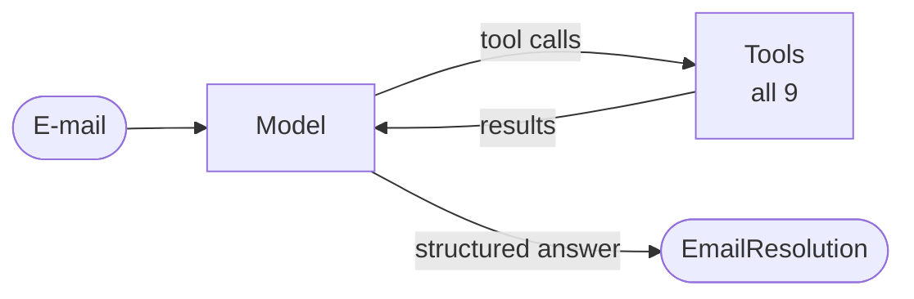

[English](../../patterns/01-single-agent.md) | Deutsch

# 1. Single Agent (die Vergleichsbasis)

> **TL;DR** Ein einzelnes LLM in einer Tool-Aufruf-Schleife übernimmt die
> gesamte Aufgabe. Es ist das einfachste und günstigste Pattern und am
> leichtesten zu debuggen. Jedes Multi-Agent-Design muss sich daran messen
> lassen. Es lässt nach, wenn es zu viele oder sich überschneidende Tools gibt
> oder wenn sich irrelevantes Material im Kontext ansammelt.

## Funktionsweise



Der Agent wiederholt *denken → Tools aufrufen (eventuell mehrere parallel) →
beobachten*, bis er ohne Tool-Aufruf antwortet. Mit `response_format` endet die
Schleife, sobald das Modell das Tool für die strukturierte Ausgabe aufruft
(oder native strukturierte Ausgabe liefert). Der gesamte Zustand ist ein
einziger Nachrichtenverlauf.

Anthropic nennt diesen Baustein das *augmented LLM* (Modell + Tools +
Retrieval + Gedächtnis). Der Leitfaden von OpenAI rät, „zuerst die Fähigkeiten
eines einzelnen Agenten auszureizen“.

## Unsere Implementierung

`src/email_assistant/native/single_agent.py`

```python
agent = create_agent(
    model,
    tools=ALL_TOOLS,                               # 5 read + 4 write tools
    system_prompt=prompts.SINGLE_AGENT,
    response_format=EmailResolution,               # -> result["structured_response"]
    middleware=[ModelCallLimitMiddleware(run_limit=15, exit_behavior="error")],
    name="customer_service_agent",
)
```

Der Graph-Knoten bildet den Workflow-State (`email`) auf den Vertrag des
Agenten (`messages`) ab und wieder zurück. Das ist die dokumentierte Technik
„Subgraph innerhalb eines Knotens aufrufen“ für abweichende Schemas.

Trace für E-1004 (zwei Anliegen), 3 Modellaufrufe:

1. parallele Lesezugriffe: `lookup_customer`, `get_invoice`, `check_service_status`,
   `search_knowledge_base` ×2
2. parallele Aktionen: `create_ticket(billing)`, `create_ticket(technical)`
3. strukturierte `EmailResolution`

In unserer Messung war dies das günstigste Pattern (16 Modellaufrufe für den
gesamten Posteingang). Mit einem echten Modell bliebe die Geschwindigkeit
gleich. Seine Schwächen lägen dann in der Zuverlässigkeit.

## Stärken

- Minimal viele bewegliche Teile: ein Prompt, eine Schleife, ein Trace.
- Durchgängiger Kontext: Der Agent erinnert sich an alles, was er getan hat,
  ohne Verluste durch Handoffs. Cognition argumentiert in „Don't build
  multi-agents“, dass Agenten mit nur einem Ausführungsstrang die
  widersprüchlichen impliziten Entscheidungen vermeiden, die parallele Agenten
  treffen.
- Parallele Tool-Aufrufe bringen bei I/O-lastigen Abfragen einen Großteil des
  Geschwindigkeitsvorteils paralleler Agenten.
- Bei kurzen Aufgaben am günstigsten in Aufrufen und Latenz.

## Schwächen und Fehlerbilder

- **Tool-Überlastung.** Der Leitfaden von OpenAI beobachtet, dass manche
  Agenten über 15 klar definierte Tools beherrschen, während andere schon mit
  weniger als 10 sich überschneidenden Tools Probleme haben. Der Benchmark von
  LangChain zeigte, dass der Single Agent stark nachlässt, sobald zwei oder mehr
  Ablenkungsdomänen hinzukommen.
- **Context Rot.** Jedes Tool-Ergebnis bleibt im Verlauf, ob relevant oder
  nicht. Der Token-Verbrauch wächst über den Lauf hinweg, und ein langes Playbook
  für jede Domäne muss in einem einzigen Prompt stehen.
- **Keine Trennung der Zuständigkeiten.** Ein Prompt enthält alle Richtlinien.
  Verschiedene Teams können nicht jeweils eigene Teile verantworten, und eine
  Änderung für Billing kann Sales beschädigen.
- **Schwache Garantien.** Nichts außer dem Prompt erzwingt die Reihenfolge
  „erst nachschlagen, dann handeln“ (vergleiche die
  [State Machine](09-state-machine.md)).

## Kosten und Latenz

Geringster Overhead pro Schritt. Die Token wachsen mit der Anzahl der
Tool-Definitionen × Aufrufe und mit der Länge des Verlaufs. Anthropic
berichtet, dass Agenten etwa 4-mal so viele Token verbrauchen wie
Chat-Interaktionen. Multi-Agent-Systeme verbrauchen etwa 15-mal so viele.

## Wann einsetzen

- Eine einzelne Domäne oder wenige Domänen mit **klar unterscheidbaren, gut
  beschriebenen Tools** (weniger als etwa 10-15).
- Aufgaben, bei denen der vom Agenten gesammelte Kontext für die gesamte
  Aufgabe relevant ist.
- Als **Vergleichsbasis** in jeder Evaluation. Microsoft nennt ihn „oft die
  richtige Standardwahl für Anwendungsfälle in Unternehmen“.

## Wann nicht einsetzen / wann weiterziehen

- In den Traces tauchen Fehler bei der Tool-Auswahl auf, oder der Prompt wird
  zum Richtlinienhandbuch. Versuchen Sie zuerst [Skills](10-skills.md) oder
  `LLMToolSelectorMiddleware`, dann einen [Router](03-router.md) oder einen
  [Supervisor](06-supervisor.md).
- Sicherheitsgrenzen: Manche Tools dürfen in bestimmten Kontexten nicht
  aufrufbar sein (vergleiche [State Machine](09-state-machine.md)).
- Große, voneinander unabhängige Teilaufgaben, die von isolierten Kontexten
  profitieren würden.

## Checkliste zur Absicherung

- `ModelCallLimitMiddleware` / `ToolCallLimitMiddleware` gegen außer Kontrolle
  geratene Schleifen (`max_model_calls` / `max_tool_calls` in der Bibliothek,
  `loop_limits()` für ein einfaches `create_agent`).
- Schreibende Tools, die Richtlinien selbst durchsetzen (unser `issue_refund`
  lehnt Beträge über 500 EUR und doppelte Erstattungen ab).
- `HumanInTheLoopMiddleware(interrupt_on={...})` für riskante Tools (erfordert
  einen Checkpointer).
- `SummarizationMiddleware` für lange Konversationen.

## Verwendung der Bibliothek

```python
from agentpatterns import create_single_agent

agent = create_single_agent(model, tools, system_prompt="...", response_format=Resolution,
                            max_model_calls=15, max_tool_calls=30)
```

Siehe [library.md](../library.md#create_single_agent).

## Quellen

- Anthropic, *Building effective agents* (2024): augmented LLM; einfach anfangen.
- OpenAI, *A practical guide to building agents*: zuerst einen einzelnen Agenten ausreizen; Beobachtungen zur Anzahl der Tools.
- LangChain, *Benchmarking multi-agent architectures* (2025): Der Single Agent lässt mit Ablenkungsdomänen nach.
- Microsoft, *AI agent orchestration patterns*: Single Agent als Standardwahl in Unternehmen.
- Cognition, *Don't build multi-agents* (2025).
