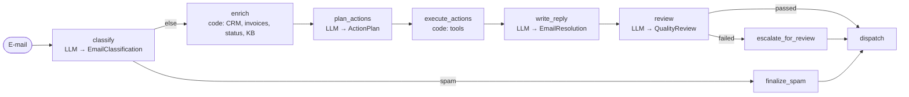

[English](../../patterns/02-sequential-pipeline.md) | Deutsch

# 2. Sequenzielle Pipeline (Prompt Chaining)

> **TL;DR** Eine feste Abfolge von Schritten: einzelne LLM-Aufrufe mit
> strukturierter Ausgabe, deterministischer Code und dazwischen Gates. Der Graph
> entscheidet, was als Nächstes passiert, nicht das Modell. Das Pattern ist
> vorhersehbar, nachvollziehbar und sparsam bei Token. Es ist aber starr, und
> Fehler aus frühen Schritten ziehen sich durch.

## Funktionsweise



Jeder LLM-Schritt ist ein einzelnes `model.with_structured_output(Schema).invoke(...)`
ohne Tool-Schleife. Die Schritte kommunizieren über typisierten Graph-State.
Gates sind einfache Python-Prädikate an bedingten Kanten. Microsoft nennt das
*sequential orchestration*, „auch bekannt als Pipeline, Prompt Chaining oder
lineare Delegation“.

## Unsere Implementierung

`src/email_assistant/native/sequential.py`

Die zentrale Designentscheidung: **Das Modell schlägt vor, der Code
entscheidet.** Der Aktionsplaner liefert einen typisierten `ActionPlan`: eine
Discriminated Union aus `RefundAction`, `TicketAction`, `LeadAction` und
`EscalationAction`. Der Knoten `execute_actions` führt sie über dieselben
richtliniendurchsetzenden Tools aus. Hier ist auch die natürliche Stelle für
einen menschlichen Freigabeschritt.

```python
planner = model.with_structured_output(ActionPlan)

def execute_actions(state):
    for action in state["plan"].actions:
        tool = ACTION_TOOL[action.kind]
        executed.append({"tool": tool, "args": ..., "result": TOOLS[tool].invoke(args)})
```

Das Retrieval (`enrich`) ist deterministischer Code: Absender, dann CRM;
per Regex gefundene Rechnungsnummern, dann Abrechnung; erwähnte Services,
dann Statusseite. Kein LLM entscheidet, welche Systeme abgefragt werden.

Zwei Gates:

1. Spam erreicht nie die teuren Schritte (1 Modellaufruf für E-1005).
2. Eine fehlgeschlagene Qualitätsprüfung führt nie zu automatischem Versand,
   sondern zu einer Eskalation.

Gemessen: 4 Modellaufrufe pro E-Mail, unabhängig von der Anzahl der Anliegen,
und die **wenigsten Token** aller Patterns (16,9k für den Posteingang), weil
jeder Aufruf nur die benötigten Fakten und keinen Verlauf von Tool-Aufrufen
mitführt.

## Hinweise zu LangGraph

- Einfacher `StateGraph` mit `add_edge` / `add_conditional_edges`.
- Das Pattern „custom workflow“ aus der Dokumentation: Jeder Knoten kann auch
  ein `create_agent` sein (siehe `agent_step` in der Bibliothek, verwendet in
  unseren parallelen und zusammengesetzten Workflows).
- Legen Sie strukturierte Ausgaben im State ab (Pydantic-Objekte), nicht als
  Freitext. So können der nächste Schritt und die Gates sie direkt verwenden.

## Stärken

- **Vorhersehbar und testbar.** Jeder Schritt lässt sich einzeln per Unit-Test
  prüfen und evaluieren. Der Graph dokumentiert den Prozess.
- **Nachvollziehbarkeit und Compliance.** Sie wissen genau, welcher Schritt
  welche Entscheidung getroffen hat, und Gates setzen harte Regeln durch.
- **Günstige Modelle pro Schritt.** Der Klassifikator kann ein kleines Modell
  sein, nur der Antwortschreiber braucht ein starkes. Anthropic: Prompt Chaining
  tauscht Latenz gegen Genauigkeit.
- **Kleinster Kontext pro Aufruf.**

## Schwächen und Fehlerbilder

- **Starr.** Alles, was der Designer nicht vorhergesehen hat (ein drittes
  Anliegen, ein unbekanntes System), wird nicht behandelt. Es gibt kein
  Backtracking, sofern Sie es nicht modellieren.
- **Frühe Fehler pflanzen sich fort.** Eine falsche Klassifizierung führt zu
  falschem Retrieval und damit zu einem falschen Plan. Ergänzen Sie Gates und
  Validierung.
- **Sequenzielle Latenz.** N Schritte bedeuten N Roundtrips. Parallelität gibt
  es nur in Kombination mit [Parallelisierung](04-parallelization.md).
- **Glue Code.** Jeder Schritt braucht einen Prompt-Builder und eine Anbindung
  an den State (`create_pipeline` aus der Bibliothek nimmt Ihnen das meiste
  davon ab).

## Wann einsetzen

- Der Prozess ist **bekannt und stabil**: Dokumentenverarbeitung,
  Formularbearbeitung, Übersetzen mit anschließender Prüfung,
  E-Mail-Triage nach fester Richtlinie.
- Regulierte Domänen, in denen jede Entscheidung nachvollziehbar sein muss.
- Kostensensible Workloads mit hohem Volumen.

## Wann nicht einsetzen

- Aufgaben mit offener Exploration oder unbekannter Anzahl von Schritten
  (verwenden Sie [Orchestrator-Worker](05-orchestrator-workers.md) oder einen
  Agenten).
- Trivial parallelisierbare Stufen (verwenden Sie
  [Parallelisierung](04-parallelization.md)).
- Microsoft: Vermeiden Sie das Pattern, wenn der Ablauf Backtracking, Iteration
  oder dynamisches Routing braucht.

## Verwendung der Bibliothek

```python
from agentpatterns import create_pipeline, llm_step, function_step

pipeline = create_pipeline([
    llm_step("classify", model, system_prompt=CLASSIFIER, output_schema=EmailClassification,
             gate=lambda s: s["outputs"]["classify"].category != "spam",
             on_gate_fail=lambda s: ignore_resolution(s)),
    function_step("enrich", enrich),            # deterministic, reads s["context"]
    llm_step("plan_actions", model, system_prompt=ACTION_PLANNER, output_schema=ActionPlan),
    function_step("execute_actions", execute_actions),
    llm_step("write_reply", model, system_prompt=REPLY_WRITER, output_schema=EmailResolution),
    llm_step("review", model, system_prompt=REVIEWER, output_schema=QualityReview,
             gate=lambda s: s["outputs"]["review"].passed, on_gate_fail=escalate),
], output="write_reply")
```

Vollständiges Beispiel: `src/email_assistant/library_based/sequential.py`. API: [library.md](../library.md#create_pipeline).

## Quellen

- Anthropic, *Building effective agents*: Prompt Chaining mit programmatischen Gates.
- LangGraph-Dokumentation, *Workflows and agents*: Beispiel für Prompt Chaining.
- LangChain-Dokumentation, *Custom workflow* (Multi-Agent): deterministische und agentische Knoten kombinieren.
- Microsoft, *AI agent orchestration patterns*: sequential orchestration und wann man sie vermeiden sollte.
