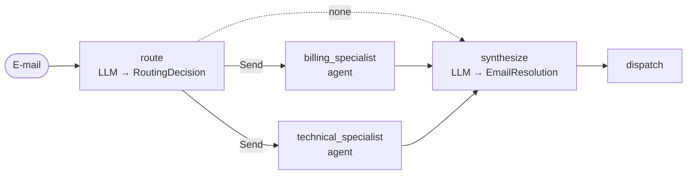

[English](../../patterns/03-router.md) | Deutsch

# 3. Router

> **TL;DR** Ein einzelner Routing-Schritt (ein LLM mit strukturierter Ausgabe
> oder Regeln) klassifiziert die Eingabe und verteilt sie an spezialisierte
> Agenten: an keinen, einen oder mehrere parallel. Ein Synthesizer führt die
> Ergebnisse zusammen. Das ist günstig und transparent, und jeder Spezialist
> erhält einen kleinen, fokussierten Kontext. Die Routing-Entscheidung fällt
> aber nur einmal, und eine Fehlleitung ist endgültig.

## Funktionsweise



1. `route` liefert `RoutingDecision(routes=[Route(agent, task), ...])`. Das Feld
   `agent` ist ein `Literal` der bekannten Spezialisten (eine Enum-Einschränkung),
   sodass das Modell keine Agenten erfinden kann.
2. Eine bedingte Kante liefert pro Route ein `Send(agent, {"task": ...})`. Die
   ausgewählten Spezialisten laufen **parallel** im selben Super-Step, jeder mit
   eigener privater Eingabe.
3. Die Spezialisten schreiben in einen gemeinsamen Schlüssel `reports` mit einem
   `operator.add`-Reducer, den parallele Schreibzugriffe erfordern.
4. `synthesize` führt die Berichte zu einer Antwort zusammen.

## Unsere Implementierung

`src/email_assistant/native/router.py`

```python
class Route(BaseModel):
    agent: Literal["billing_specialist", "technical_specialist", "sales_specialist", "relations_specialist"]
    task: str

def fan_out(state):
    if not state["routes"]:
        return "synthesize"
    return [Send(r.agent, {"task": r.task}) for r in state["routes"]]
```

Die Spezialisten sind `create_agent`s mit ausschließlich ihren Domänen-Tools
(4-5 statt 9) und liefern einen strukturierten `SpecialistReport` (Befunde,
Aktionen mit Referenznummern und einen Absatz für den Kunden).

Gemessen: 5 Aufrufe für E-Mails mit einem Anliegen (1 Routing + 3 Spezialist +
1 Synthese) und 8 für E-1004 mit zwei Anliegen, bei dem beide Spezialisten
gleichzeitig laufen. Spam kostet 2 Aufrufe (Routing an niemanden, dann
entscheidet der Synthesizer „ignorieren“).

## Router vs. Supervisor

Beide können an mehrere Agenten verteilen. Der Unterschied laut
LangChain-Dokumentation: Ein Router ist ein einzelner Klassifizierungsschritt
ohne Konversations-State. Ein Supervisor ist ein vollwertiger Agent, der
Kontext behält und nach Sichtung der Ergebnisse neu entscheiden kann.
Verwenden Sie einen Router, wenn die **Eingabekategorien klar** sind.
Verwenden Sie einen [Supervisor](06-supervisor.md), wenn der nächste Schritt
davon abhängt, was zurückkommt.

## Zustandslos vs. zustandsbehaftet

Router sind zustandslos und bezahlen den Routing-Aufruf in jeder Gesprächsrunde. Die
LangChain-Dokumentation zeigt 6 Aufrufe für eine wiederholte Anfrage, gegenüber
5 bei Handoffs oder Skills. Für Chat können Sie den Router als Tool eines
Konversationsagenten verpacken. Dieser behält das Gedächtnis, während der
Router zustandslos bleibt:

```python
search = agent_as_tool(AgentSpec("help_desk", "Answers product questions", router))
chat = create_agent(model, tools=[search], checkpointer=InMemorySaver())
```

## Stärken

- **Günstige, schnelle Verteilung.** Der Routing-Aufruf kann ein kleines Modell
  nutzen. Im Beispiel von Anthropic gehen einfache Fragen an Haiku und schwierige
  an ein stärkeres Modell.
- **Kontextisolation pro Vertikale.** Jeder Spezialist sieht nur seine Aufgabe
  und seine Tools. Das hilft vor allem bei großem domänenspezifischem Kontext
  (LangChain: etwa 9k vs. 15k Token gegenüber Skills in ihrem
  Multi-Domain-Beispiel).
- **Parallele Behandlung mehrerer Anliegen** über `Send`.
- **Transparent.** Die Routing-Entscheidung ist ein strukturiertes Objekt, das
  Sie loggen, evaluieren und testen können.

## Schwächen und Fehlerbilder

- **Eine Fehlleitung ist endgültig.** Nichts leitet neu weiter, wenn ein
  Spezialist feststellt, dass die Anfrage nicht für ihn war. Gegenmaßnahmen:
  eine Fallback-Route, ein „allgemeiner“ Agent, Konfidenzschwellen oder
  stattdessen ein Supervisor.
- **Der Aufgabentext ist der einzige Kontext.** Der Router muss in sich
  geschlossene Aufgaben formulieren. Verlustbehaftete Aufgaben führen zu
  schlechten Ergebnissen der Spezialisten.
- **Syntheseschritt.** Er kostet einen zusätzlichen Aufruf und ist eine zweite
  Gelegenheit, Details zu verlieren (überspringen Sie ihn bei Antworten mit nur
  einer Route; die Bibliothek tut das standardmäßig, wenn keine strukturierte
  Ausgabe angefordert wird).
- **Wiederholte Routing-Kosten** in Konversationen mit mehreren Gesprächsrunden (siehe oben).

## Wann einsetzen

- Klar getrennte **Vertikalen**, die jeweils eigene Prompts, Tools oder eigenes
  Wissen brauchen: Billing / Technik / Sales, HR / IT / Recht oder mehrere
  Wissensquellen.
- Eingaben, die mehrere unabhängig voneinander bearbeitbare Anfragen enthalten
  können.
- Wenn Sie deterministisches, regelbasiertes Routing wünschen (Bibliothek:
  `route_fn=`).

## Wann nicht einsetzen

- Der richtige Bearbeiter zeigt sich erst während der Arbeit (verwenden Sie
  einen [Supervisor](06-supervisor.md)).
- Spezialisten müssen über mehrere Gesprächsrunden mit dem Nutzer sprechen (verwenden Sie
  [Handoffs](09-state-machine.md)).
- Eine einzelne Domäne (ein Router fügt dann nutzlos einen Hop hinzu).

## Verwendung der Bibliothek

```python
from agentpatterns import AgentSpec, create_router

router = create_router(
    model,
    [AgentSpec("billing_specialist", "Invoices, refunds", billing_agent),
     AgentSpec("technical_specialist", "Outages, bugs", tech_agent)],
    system_prompt=ROUTER, synthesizer_prompt=REPLY_WRITER, response_format=EmailResolution,
)
```

Vollständiges Beispiel: `src/email_assistant/library_based/router.py`. API: [library.md](../library.md#create_router).

## Quellen

- Anthropic, *Building effective agents*: Routing zu spezialisierten Prompts und Modellen.
- LangChain-Dokumentation, *Router* (Multi-Agent), *Workflows and agents* (Routing) und das Router-Tutorial zur Wissensdatenbank (`Send`).
- LangChain-Dokumentation, Multi-Agent-Übersicht: Performance-Tabellen (One-Shot, wiederholte Anfrage, Multi-Domain).
- Microsoft: deterministisches Routing bevorzugen, wenn der Bearbeiter aus der Eingabe erkennbar ist.
