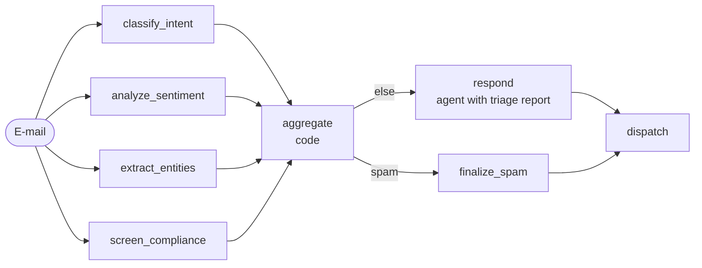

[English](../../patterns/04-parallelization.md) | Deutsch

# 4. Parallelisierung (Fan-out / Fan-in)

> **TL;DR** Mehrere Zweige laufen gleichzeitig, und ihre Ergebnisse werden
> zusammengeführt. Es gibt drei Varianten: **Sectioning** (verschiedene
> Teilaufgaben auf derselben Eingabe), **Voting** (dieselbe Aufgabe N-mal, die
> Mehrheit gewinnt) und **Map-Reduce** (dieselbe Aufgabe über N Elemente). Das
> senkt die Latenz und erhöht die Robustheit, vervielfacht aber die Kosten und
> erfordert eine Regel zum Zusammenführen.

## Funktionsweise



- **Statisches Fan-out:** mehrere `add_edge(START, branch)`. LangGraph führt sie
  im selben Super-Step aus.
- **Fan-in:** `add_edge([b1, b2, b3, b4], "aggregate")` wartet auf *alle*
  Zweige.
- **Dynamisches Fan-out** (Voting, Map-Reduce): Eine bedingte Kante liefert eine
  Liste von `Send(node, private_input)`.
- **State:** Die Zweige schreiben in verschiedene Schlüssel oder in einen
  gemeinsamen Schlüssel mit Reducer (`operator.add`, Dict-Merge). Ohne Reducer
  lösen parallele Schreibzugriffe auf einen Schlüssel `InvalidUpdateError` aus.

## Unsere Implementierung

`src/email_assistant/native/parallel.py`

**Sectioning:** Vier Analysten (Anliegen, Stimmung, Entitäten, Compliance),
jeweils ein einzelner Aufruf mit strukturierter Ausgabe, betrachten die E-Mail
gleichzeitig. Einfacher Code führt sie zu einem Triage-Bericht zusammen. So
kann beispielsweise die Compliance-Prüfung die Kategorie auf Spam
überschreiben, und die Priorität ist das Maximum aus Anliegen und
Dringlichkeit. Anschließend bearbeitet ein Antwort-Agent die E-Mail mit dem
Triage-Bericht im Prompt. Das entspricht der Idee aus dem Leitfaden von
Anthropic, eine „Guardrail neben der Hauptaufgabe laufen zu lassen“.

**Map-Reduce:** `build_inbox_digest_graph(per_email_workflow)` schickt jede
E-Mail des Posteingangs parallel an einen beliebigen Workflow pro E-Mail
(beliebiges Pattern) und reduziert die Ergebnisse zu einem Digest (Anzahl nach
Kategorie und Status, dringend, eskaliert).

```python
def fan_out(state):
    return [Send("process_email", {"email": e}) for e in state["emails"]]
```

Gemessen: 7 Aufrufe pro E-Mail (4 Analysten + 3 Antwort-Agent), unabhängig von
der Anzahl der Anliegen. Spam kostet trotzdem 4, weil das Fan-out vor dem Gate
stattfindet. Die Latenz entspricht etwa einem Analystenaufruf statt vier
sequenziellen.

## Stärken

- **Latenz.** Die Laufzeit entspricht ungefähr der des langsamsten Zweigs. Das
  Research-System von Anthropic verkürzte die Recherchezeit mit parallelen
  Subagenten und parallelen Tool-Aufrufen um bis zu 90%.
- **Trennung der Zuständigkeiten.** Jeder Analyst hat eine eng umrissene
  Aufgabe und einen eigenen Prompt, ist leicht zu evaluieren und kann auf einem
  kleineren Modell laufen.
- **Robustheit.** Voting verringert die Varianz, und unabhängige Guardrails
  fangen ab, was der Hauptpfad übersieht.
- **Batch-Durchsatz.** Map-Reduce über Tausende Elemente, mit einem beliebigen
  Workflow als Mapper.

## Schwächen und Fehlerbilder

- **Die Kosten vervielfachen sich:** N Zweige bedeuten N× Token, und jeder
  Zweig läuft, auch wenn er nicht gebraucht wird (Spam hat hier vier Analysten
  bezahlt).
- **Konflikte beim Zusammenführen:** Zweige können sich widersprechen (der
  Anliegen-Analyst sagt Billing, die Compliance-Prüfung sagt Phishing). Sie
  brauchen eine explizite Vorrangregel, Voting oder einen LLM-Synthesizer.
- **Rate Limits und Kontingente** bei breitem Fan-out. Begrenzen Sie die
  Breite des Fan-outs.
- **Nicht für abhängige Schritte.** Wenn B die Ausgabe von A braucht, verwenden
  Sie eine [Pipeline](02-sequential-pipeline.md) oder einen
  [Orchestrator](05-orchestrator-workers.md).
- Microsoft warnt vor gemeinsam genutztem, veränderlichem Zustand zwischen
  nebenläufigen Agenten.

## Wann einsetzen

- Unabhängige Analysen derselben Eingabe (Klassifizierung, Extraktion,
  Compliance, Stimmung).
- Guardrails, die parallel zur Generierung laufen.
- Voting, wenn ein einzelner Aufruf zu unzuverlässig ist und die Antwort
  diskret ist (Kategorie, ja/nein, Schweregrad).
- Batch- oder Backoffice-Verarbeitung (Map-Reduce), zum Beispiel nächtliche
  Digests des Posteingangs.

## Wann nicht einsetzen

- Die Schritte hängen voneinander ab.
- Budgetkritische Workloads, bei denen die meisten Zweige vergeudet wären. Ziehen
  Sie einen [Router](03-router.md) in Betracht, der nur die benötigten Zweige
  startet.

## Verwendung der Bibliothek

```python
from agentpatterns import AgentSpec, create_parallel, create_voting, create_map_reduce

triage = create_parallel([intent, sentiment, entities, compliance],
                         aggregator=lambda results, state: merge(results))
robust = create_voting(AgentSpec("classifier", "...", classifier_agent), n=5,
                       key=lambda r: r.structured.category)
digest = create_map_reduce(email_workflow, prepare=lambda e: {"email": e},
                           extract=summarize, reduce=build_digest)
```

`src/email_assistant/library_based/parallel.py` zeigt Sectioning als Teil einer
Pipeline (Triage, ein Spam-Gate, dann die Antwort). `composite.py` zeigt
Map-Reduce über den Posteingang. API: [library.md](../library.md#create_parallel).

## Quellen

- Anthropic, *Building effective agents*: Sectioning und Voting;
  *Multi-agent research system*: Parallelität verkürzte die Zeit um bis zu 90%.
- LangGraph-Dokumentation, *Workflows and agents* (Parallelisierung) und *Graph API* (`Send`, Reducer).
- Microsoft, *Concurrent orchestration* (Fan-out/Fan-in, Scatter-Gather, Map-Reduce).
- Du et al. (2023), Multi-Agent-Debatte / Voting für bessere Reasoning-Qualität.
