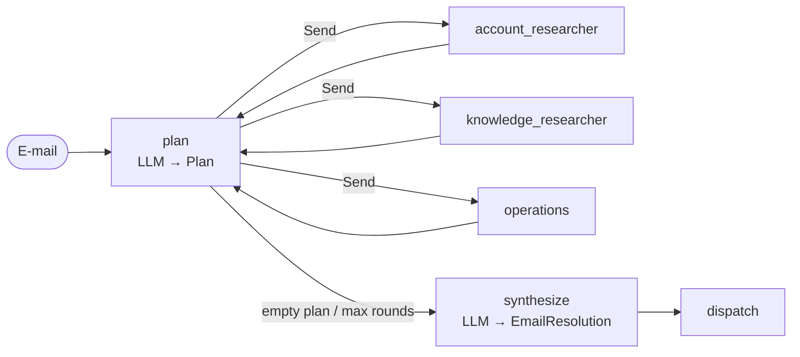

[English](../../patterns/05-orchestrator-workers.md) | Deutsch

# 5. Orchestrator-Worker (und Plan-and-Execute)

> **TL;DR** Ein Orchestrator-LLM zerlegt den Auftrag *zur Laufzeit* in Aufgaben
> (strukturierte Ausgabe), Worker führen sie parallel aus, und der Orchestrator
> kann anhand der Ergebnisse neu planen (erst recherchieren, dann handeln),
> bevor ein Synthesizer die Antwort schreibt. Das Pattern ist flexibel, wo sich
> Teilaufgaben nicht vorab festlegen lassen, und der Plan ist explizit und
> überprüfbar. Es kostet mehr Aufrufe und hängt von guter Planung ab.

## Funktionsweise



- Der Planer liefert `Plan(tasks=[PlannedTask(worker, instruction), ...])`,
  wobei `worker` ein `Literal` der Worker-Namen ist.
- `Send` startet einen Worker pro Aufgabe. Derselbe Worker-Typ kann mehrere
  Aufgaben erhalten, was ein Router nicht kann.
- Die Worker hängen `{"worker", "instruction", "output"}` an einen
  Reducer-Schlüssel an.
- **Neuplanung:** Die Worker führen zurück zu `plan`. Der Planer sieht alle
  Ergebnisse und liefert weitere Aufgaben oder eine leere Liste (fertig). Eine
  Rundenobergrenze (`MAX_ROUNDS`) begrenzt die Schleife.

Anthropic beschreibt das Pattern so: „Der entscheidende Unterschied zur
Parallelisierung ist die Flexibilität – Teilaufgaben sind nicht vordefiniert,
sondern werden vom Orchestrator bestimmt.“ Mit Neuplanung wird daraus
*Plan-and-Execute* (LangChain-Blog 2024; Microsofts „magentic“ Orchestrierung
mit einem Task Ledger).

## Unsere Implementierung

`src/email_assistant/native/orchestrator.py`

Die Worker sind **funktional** geschnitten, nicht nach Fachdomänen: ein
Account-Rechercheur (CRM, Rechnungen), ein Wissens-Rechercheur (KB, Status,
Preise) und ein Operations-Agent (alle schreibenden Tools). Dadurch wird die
Planung sichtbar:

| Runde | Plan für E-1004 |
|---|---|
| 1 | account_researcher: `lookup_customer`, `get_invoice(INV-2026-0901)`; knowledge_researcher: `check_service_status(export)`, zwei KB-Suchen |
| 2 | operations: `create_ticket(billing, ...)`, `create_ticket(technical, ...)`, abgeleitet aus den Ergebnissen von Runde 1 |
| 3 | leerer Plan, dann Synthese |

Der Planer schreibt explizite Anweisungen („Call create_ticket with {...}“).
Explizite Aufgaben helfen: Beim Research-System von Anthropic führte vage
Delegation zu doppelter Arbeit und Lücken.

Gemessen: 10 Aufrufe pro E-Mail (3 Planung + 2×2 Recherche + 2 Operations + 1
Synthese). Das ist das Pattern mit den meisten Aufrufen, unabhängig von der
Anzahl der Anliegen. Spam kostet 2 (leerer Plan, dann Synthese).

## Hinweise zu LangGraph

- Planung: `model.with_structured_output(Plan)` (die Bibliothek nutzt die
  native strukturierte Ausgabe des Anbieters, wo verfügbar).
- Fan-out: eine bedingte Kante, die `[Send(worker, {...}) for task in plan]`
  liefert.
- Die Rückführung zum Planer ist eine gewöhnliche Kante. Der Rundenzähler liegt
  im State.
- Verschachtelte strukturierte Pläne (eine Liste von Pydantic-Modellen mit
  `Literal`-Feldern) funktionieren sowohl mit Tool-Aufrufen als auch mit nativer
  strukturierter Ausgabe.

## Orchestrator vs. Router vs. Supervisor

| | Router | Orchestrator-Worker | Supervisor |
|---|---|---|---|
| Entscheidung | Eingabe einmal klassifizieren | in Aufgaben zerlegen; optional neu planen | Agent-Schleife: delegieren, beobachten, entscheiden |
| Plan im State sichtbar | Routen | **ja, `plan` + `results`** | nur in Nachrichten |
| Derselbe Worker mehrfach | nein | **ja** | ja |
| Kontrollfluss | Graph | Graph + Planungsschleife | Modell |

## Stärken

- **Bewältigt unbekannte Teilaufgaben.** Anzahl und Art der Aufgaben richten
  sich nach der Eingabe und den Zwischenergebnissen.
- **Expliziter, nachvollziehbarer Plan.** Sie können ihn loggen, vor der
  Ausführung validieren (zum Beispiel „Operations-Aufgaben brauchen eine
  Freigabe“) oder von einem Menschen bearbeiten lassen.
- **Parallele Worker** mit isolierten Kontexten. Worker können günstigere
  Modelle nutzen („der größere Agent muss nicht nach jeder Aktion konsultiert
  werden“, Plan-and-Execute-Beitrag von LangChain).
- **Trennung von Denken und Handeln.** Lesende Recherche läuft vor
  Schreibzugriffen.

## Schwächen und Fehlerbilder

- **Die Qualität des Planers ist entscheidend.** Eine schlechte Zerlegung führt
  zu doppelter oder fehlender Arbeit. Microsoft merkt an, dass Manager im
  Magentic-Stil langsam konvergieren und bei mehrdeutigen Zielen ins Stocken
  geraten können.
- **Latenz der Runden.** Jede Runde besteht aus Planung und dann dem
  langsamsten Worker.
- **Veraltete Pläne.** Ohne Neuplanung kann ein Plan nicht auf Überraschungen
  reagieren.
- **Die meisten Aufrufe** in unserem Vergleich, und die Kosten schwanken stärker
  als bei jedem anderen Pattern.

## Wann einsetzen

- Aufgaben, deren Teilaufgaben von der Eingabe und von früheren Ergebnissen
  abhängen: Recherche, Änderungen über mehrere Dateien, Fallbearbeitung nach dem
  Schema „erst recherchieren, dann handeln“.
- Wenn Sie einen überprüfbaren Plan wollen (Compliance, Freigabe von Plänen,
  Debugging).
- Lange Aufgaben, bei denen ein Planer-Modell günstigere Ausführungsmodelle
  koordiniert.

## Wann nicht einsetzen

- Feste Prozesse (verwenden Sie eine [Pipeline](02-sequential-pipeline.md));
  klare Kategorien (verwenden Sie einen [Router](03-router.md)).
- Kurze interaktive Aufgaben, bei denen die zusätzlichen Planungsrunden die
  Latenz verschlechtern.

## Verwendung der Bibliothek

```python
from agentpatterns import AgentSpec, create_orchestrator

orchestrator = create_orchestrator(
    model,
    [AgentSpec("account_researcher", "CRM and billing lookups", account_agent),
     AgentSpec("knowledge_researcher", "KB, status, pricing", knowledge_agent),
     AgentSpec("operations", "Side-effect actions", ops_agent)],
    planner_prompt=PLANNER, synthesizer_prompt=REPLY_WRITER,
    response_format=EmailResolution, max_rounds=3,
)
```

Bereits erledigte Arbeit kann als `results` übergeben werden. Der Planer plant
dann nur, was noch fehlt. So überarbeitet ein Orchestrator innerhalb einer
Review-Schleife seine Recherche, statt sie zu wiederholen: siehe das
[Rezept für Recherche mit Review](../library.md#rezept-recherche-mit-review).

API: [library.md](../library.md#create_orchestrator).

## Quellen

- Anthropic, *Building effective agents* (Orchestrator-Worker); *Multi-agent research system* (explizite Delegation, Skalierung des Aufwands, Token-Kosten).
- LangGraph-Dokumentation, *Workflows and agents*: Orchestrator-Worker mit `Send`.
- LangChain-Blog, *Plan-and-Execute Agents* (2024): ReWOO, LLMCompiler.
- Microsoft, *Magentic orchestration*.
