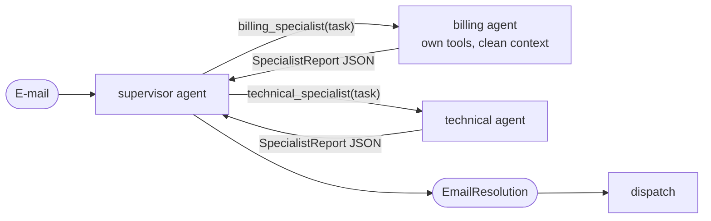

[English](../../patterns/06-supervisor.md) | Deutsch

# 6. Supervisor mit Subagenten als Tools

> **TL;DR** Ein Haupt-Agent (der Supervisor) ruft spezialisierte Subagenten
> **als Tools** auf. Er entscheidet, wen er mit welcher Aufgabe aufruft,
> eventuell mehrere parallel, sieht deren Ergebnisse und stellt die Antwort
> zusammen. Das ist der von LangChain v1 empfohlene Multi-Agent-Standard:
> zentrale Steuerung, starke Kontextisolation, einfache Zuständigkeit für
> Teams. Es kostet einen zusätzlichen Hop, und die Ergebnisse laufen durch den
> Supervisor („Stille Post“).

## Funktionsweise



- Jeder Subagent ist ein `create_agent`, verpackt in ein `@tool`. Sein Name und
  seine Beschreibung sind das Routing-Signal.
- **Eingabe** (Context Engineering): Standardmäßig nur der Aufgabentext, sodass
  der Subagent mit einem sauberen Kontextfenster startet. Alternativ können Sie
  die Konversation des übergeordneten Agenten in den Subagenten *forken* (Deep
  Agents nennt diese Modi `isolated` und `fork`).
- **Ausgabe:** Nur das Endergebnis des Subagenten geht zurück. Seine internen
  Tool-Aufrufe bleiben privat. Wir geben den strukturierten `SpecialistReport`
  als JSON zurück, sodass der Supervisor Fakten statt Fließtext erhält.
- Parallele Tool-Aufrufe erlauben es dem Supervisor, in einer Runde mehrere
  Subagenten zu konsultieren.

Die LangChain-Dokumentation stellt fest, dass *„das Paket langgraph-supervisor
nicht mehr aktiv gepflegt wird“*, und empfiehlt stattdessen dieses Pattern.
Anders als beim alten Handoff-basierten Supervisor sind die Worker keine
Graph-Knoten, die die Kontrolle zurückgeben, sondern Tools.

## Unsere Implementierung

`src/email_assistant/native/supervisor.py`

```python
def make_specialist_tool(model, domain):
    specialist = create_agent(model, tools=DOMAIN_TOOLS[domain], system_prompt=prompts.SPECIALISTS[domain],
                              response_format=SpecialistReport, name=f"{domain}_specialist")

    @tool(f"{domain}_specialist", description=prompts.SPECIALIST_DESCRIPTIONS[domain])
    def call_specialist(task: str) -> str:
        result = specialist.invoke({"messages": [HumanMessage(task)]})
        return result["structured_response"].model_dump_json()
    return call_specialist

supervisor = create_agent(model, tools=[make_specialist_tool(model, d) for d in DOMAIN_TOOLS],
                          system_prompt=prompts.SUPERVISOR, response_format=EmailResolution)
```

Für E-1004 setzt der Supervisor `billing_specialist(...)` und
`technical_specialist(...)` als **parallele Tool-Aufrufe** ab (die Tools laufen
nebenläufig) und führt dann beide Berichte zu einer Antwort zusammen.

Gemessen: 5 Aufrufe für E-Mails mit einem Anliegen (delegieren + 3 Spezialist +
zusammenstellen), 8 für zwei Anliegen, 1 für Spam (der Supervisor antwortet
direkt „ignorieren“, ohne zu delegieren).

## Designentscheidungen (aus der LangChain-Dokumentation)

| Entscheidung | Optionen | Unsere Wahl |
|---|---|---|
| Tool-Pattern | ein Tool pro Agent / ein einzelnes Dispatch-Tool `task(agent_name, description)` | ein Tool pro Agent (die Bibliothek unterstützt beides) |
| Spezifikation der Subagenten | System-Prompt / Enum-Einschränkung / Discovery-Tool | Tool-Beschreibungen + Katalog im Prompt |
| Eingaben | nur die Anfrage (isolated) / voller Kontext (fork) | isolated |
| Ausgaben | letzte Nachricht / strukturiert / zusätzlicher State über `Command` | strukturierter Bericht |
| Sync vs. async | blockierend / Hintergrundjobs mit Status-Tools | blockierend |

## Stärken

- **Zentrale Steuerung und Flexibilität.** Der Supervisor kann mehrere
  Subagenten aufrufen, sie erneut aufrufen oder selbst antworten, alles
  adaptiv.
- **Kontextisolation.** Subagenten können intern Tausende Token verbrauchen,
  liefern aber ein kompaktes Ergebnis. LangChain maß in einem
  Multi-Domain-Beispiel 67% weniger Token als mit Skills. Das Research-System
  von Anthropic aus Lead-Agent und Subagenten übertraf einen Single Agent in der
  internen Evaluation um 90,2%.
- **Verteilte Entwicklung.** Teams verantworten Subagenten unabhängig
  voneinander, und es funktioniert mit Agenten von Drittanbietern, weil es „die
  wenigsten Annahmen über die zugrunde liegenden Agenten trifft“
  (LangChain-Benchmark).
- **Parallelität** über parallele Tool-Aufrufe.

## Schwächen und Fehlerbilder

- **Stille Post.** Der Supervisor formuliert die Ausgabe der Subagenten um.
  LangChain behob das mit einem `forward_message`-Tool, indem es
  Handoff-Nachrichten aus dem Kontext der Subagenten entfernte und die
  Tool-Namen optimierte. Das brachte eine Verbesserung von fast 50%.
  Strukturierte Berichte helfen ebenfalls.
- **Zusätzlicher Hop.** 4 vs. 3 Aufrufe im One-Shot-Beispiel von LangChain, und
  das wiederholt sich bei jeder Anfrage, weil Subagenten zustandslos sind
  (8 Aufrufe über zwei Gesprächsrunden vs. 5 bei Handoffs).
- **Subagenten, die nicht berichten.** Die Dokumentation warnt, dass ein
  Subagent die Arbeit erledigen, die Ergebnisse aber in seiner letzten Nachricht
  weglassen kann. Verwenden Sie strukturierte Ausgabe oder explizite Prompts
  („der Koordinator sieht nur Ihren abschließenden Bericht“).
- **Vage Delegation.** Aufgaben brauchen ein Ziel, den Kontext, Erwartungen an
  die Ausgabe und Grenzen.
- **Keine direkte Interaktion mit dem Nutzer** durch Subagenten, außer über
  `interrupt()`.

## Wann einsetzen

- **Mehrere klar getrennte Domänen** (Kalender, E-Mail, CRM, Abrechnung), bei
  denen Subagenten nicht mit dem Nutzer sprechen müssen.
- Parallele Arbeit über mehrere Domänen, rechercheartige Aufgaben mit
  Breitensuche.
- Agenten, die von Teams verantwortet werden oder von Drittanbietern stammen,
  hinter einer stabilen Tool-Schnittstelle.
- Als Standard, wenn ein einzelner Agent nicht mehr ausreicht.

## Wann nicht einsetzen

- Nur wenige Tools: Verwenden Sie einen [Single Agent](01-single-agent.md).
- Der Spezialist muss mit dem Nutzer eine Konversation über mehrere
  Gesprächsrunden führen: Verwenden Sie [Handoffs](09-state-machine.md).
- Eng gekoppelte Schreibzugriffe, bei denen Agenten den gesamten Kontext teilen
  müssen. Der Folgebeitrag von Cognition aus 2026 empfiehlt Schreibzugriffe in
  einem einzigen Ausführungsstrang mit Hilfsagenten, die nur lesen.

## Hinweise zum Betrieb

- Subagenten erben pro Aufruf den Checkpointer des übergeordneten Agenten,
  sodass `interrupt()` innerhalb eines Subagenten funktioniert, wenn der äußere
  Graph einen Checkpointer hat.
- Subagenten, die innerhalb von Tools aufgerufen werden, sind statisch nicht
  auffindbar, daher zeigt `get_state(subgraphs=True)` sie nicht an. Rufen Sie
  sie aus Graph-Knoten auf, wenn Sie das brauchen.
- Begrenzen Sie die Schleife des Supervisors (`max_model_calls`) und bei Bedarf,
  wie oft jeder Subagent aufgerufen werden darf (`max_calls_per_agent`).
  Limits für Subagenten gelten pro Aufruf. Verwenden Sie daher ein `RunBudget`,
  um die Gesamtsumme zu begrenzen.

## Verwendung der Bibliothek

```python
from agentpatterns import AgentSpec, create_supervisor

supervisor = create_supervisor(
    model,
    [AgentSpec("billing_specialist", "Invoices, refunds", billing_agent), ...],
    system_prompt=SUPERVISOR,
    response_format=EmailResolution,
    delegation="tool_per_agent",   # or "task_tool"
    input_mode="task",             # or "fork"
)
```

API: [library.md](../library.md#create_supervisor).

## Quellen

- LangChain-Dokumentation, *Subagents* (Multi-Agent); *Migrate from langgraph-supervisor*; *Subgraph persistence*.
- LangChain-Blog, *Benchmarking multi-agent architectures* (Verbesserungen am Supervisor, etwa 50%).
- Anthropic, *How we built our multi-agent research system* (+90,2%, etwa 15× Token, Qualität der Delegation).
- OpenAI Agents SDK: Agenten als Tools vs. Handoffs.
