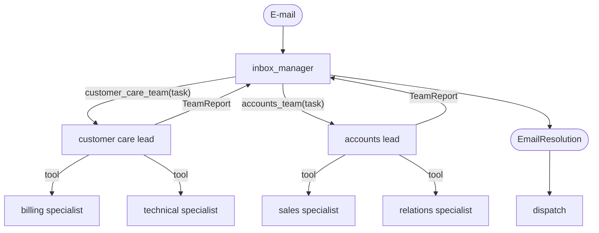

[English](../../patterns/07-hierarchical.md) | Deutsch

# 7. Hierarchische Teams (Supervisor von Supervisoren)

> **TL;DR** Das Supervisor-Pattern, verschachtelt: Ein Agent auf oberster Ebene
> delegiert an Team-Leads, die wiederum an ihre Mitglieder delegieren. Jeder
> Supervisor sieht nur wenige Tools. Dadurch skaliert der Entwurf auf viele
> Agenten und bildet die Organisation ab. Jede Ebene kostet zusätzliche Latenz,
> Token und einen weiteren Zusammenfassungsschritt.

## Funktionsweise



Jeder Team-Lead ist ein `create_agent`, dessen Tools seine Mitglieder sind. Er
selbst ist wiederum als Tool der darüberliegenden Ebene gekapselt. Der
LangChain-Migrationsleitfaden für `langgraph-supervisor` nennt zwei Optionen für
verschachtelte Supervisoren: auf einen einzigen Supervisor abflachen oder
Tool-Aufrufe verschachteln, „wenn Sie eine Koordination auf Zwischenebene
benötigen“.

## Unsere Implementierung

`src/email_assistant/native/hierarchical.py`

- Ebene 1: `inbox_manager` mit den Tools `customer_care_team` und `accounts_team`.
- Ebene 2: Team-Leads mit den Spezialisten-Tools ihres Teams. Sie liefern einen
  strukturierten `TeamReport` (zusammengeführte Befunde, Aktionen,
  Antwortabsätze).
- Ebene 3: die Spezialisten aus dem [Supervisor](06-supervisor.md)-Pattern.

Bei E-1004 ist nur das Customer-Care-Team beteiligt. Dessen Lead ruft Billing
und Technical parallel auf.

Gemessen: 7 Aufrufe für E-Mails mit einem einzigen Anliegen (Manager 2 + Lead 2
+ Spezialist 3), 10 für E-1004. Jede Ebene kostet gegenüber dem flachen
Supervisor (5 / 8) 2 zusätzliche Aufrufe (Delegieren + Zusammenstellen).

## Stärken

- **Skaliert die Anzahl der Agenten.** Jeder Supervisor wählt zwischen 2-5
  Optionen statt zwischen 20. Das hält das Routing zuverlässig und die Prompts
  kurz.
- **Bildet Zuständigkeiten ab.** Teams können einen ganzen Teilbaum
  verantworten (ihren Lead-Prompt, ihre Mitglieder und Richtlinien).
- **Lokaler Kontext.** Team-interne Details bleiben im Team. Die oberste Ebene
  sieht nur Team-Berichte.
- Team-Leads können teamspezifische Regeln ergänzen (zum Beispiel
  „Rechnungskorrekturen brauchen immer ein Ticket“), ohne die oberste Ebene
  anzufassen.

## Schwächen und Fehlermodi

- **Latenz und Kosten pro Ebene.** Mindestens zwei zusätzliche sequenzielle
  Aufrufe pro Ebene.
- **Sich aufsummierender Informationsverlust durch Zusammenfassung.** Jede
  Ebene formuliert die darunterliegende Ebene um. Strukturierte Berichte
  mildern das ab.
- **Schwierigeres Debugging und schwierigere Zuordnung.** Welche Ebene hat die
  falsche Entscheidung getroffen? Nutzen Sie Tracing mit Agentennamen.
- **Gefahr des Over-Engineerings.** Bei 4 Spezialisten (wie hier) ist ein
  flacher Supervisor besser. Die Hierarchie lohnt sich bei vielen Agenten oder
  bei Organisationsgrenzen.

## Wann einsetzen

- Mehr Blatt-Agenten, als ein Supervisor zuverlässig routen kann (grob mehr als
  7-10 oder sich überschneidende Beschreibungen).
- Organisationen, in denen Teams vollständige Teildomänen verantworten, jeweils
  mit eigener Koordinationslogik.
- Wenn verschiedene Ebenen unterschiedliche Modelle (starke oberste Ebene,
  günstige Team-Leads) oder Richtlinien brauchen.

## Wann nicht einsetzen

- Wenige Agenten: auf einen einzigen [Supervisor](06-supervisor.md) abflachen.
- Latenzkritische, interaktive Pfade.

## Hinweise für den Betrieb

- Nur der äußerste Graph braucht einen Checkpointer. `interrupt()`-Aufrufe tief
  im Baum werden bis nach oben weitergereicht, und `Command(resume=...)`
  funktioniert über alle Ebenen hinweg.
- Geben Sie jeder Ebene ein Aufruf-Limit. Schleifen multiplizieren sich über
  die Ebenen: `max_model_calls` und `max_calls_per_agent` gelten auf jeder
  Ebene, und ein `RunBudget` begrenzt die Gesamtzahl.

## Verwendung der Bibliothek

```python
from agentpatterns import Team, create_hierarchy

hierarchy = create_hierarchy(
    model,
    teams=[
        Team("customer_care_team", "Billing and technical support", system_prompt=CARE_LEAD,
             members=[billing_spec, technical_spec], response_format=TeamReport),
        Team("accounts_team", "Sales and customer relations", system_prompt=ACCOUNTS_LEAD,
             members=[sales_spec, relations_spec], response_format=TeamReport),
    ],
    system_prompt=INBOX_MANAGER,
    response_format=EmailResolution,
)
```

Teams können Teams enthalten (beliebig tief). Blätter sind `AgentSpec`s, die
jeder Graph sein können, der den Agent-Vertrag erfüllt. API:
[library.md](../library.md#create_hierarchy).

## Quellen

- LangChain-Dokumentation, *Migrate from langgraph-supervisor* (verschachtelte Supervisoren; Weiterreichen von Interrupts).
- Google ADK, *Hierarchical decomposition*; Skalierungsstudie von Google Research (zentrale Koordination begrenzt die Fehlerverstärkung: 4,4× gegenüber 17,2× bei unabhängigen Agenten).
- Microsoft, *AI agent orchestration patterns*.
