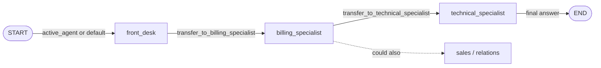

[English](../../patterns/08-swarm-handoffs.md) | Deutsch

# 8. Swarm / Netzwerk gleichrangiger Agenten (Handoffs zwischen Agenten)

> **TL;DR** Die Agenten sind gleichrangig. Der aktive Agent arbeitet und
> **übergibt die Kontrolle** per Tool-Aufruf, sobald ein anderer Agent besser
> geeignet ist. Es gibt keinen Koordinator, und der aktive Agent bleibt über
> Gesprächsrunden hinweg gespeichert. Das passt zu Gesprächen, in denen
> wechselt, „wer“ zuständig ist. Die Ausführung ist sequenziell, jeder Agent
> muss die anderen kennen, und es besteht das Risiko von Handoff-Schleifen und
> wachsendem Kontext.

## Funktionsweise



- Jeder Agent ist ein `create_agent`, der **direkt als Subgraph-Knoten** in
  einen gemeinsamen `StateGraph` eingefügt wird. Die Knoten teilen sich den
  Kanal `messages`.
- Ein Handoff-Tool gibt
  `Command(goto="technical_specialist", graph=Command.PARENT, update={...})`
  zurück. Durch `graph=Command.PARENT` findet der Sprung im Swarm-Graph statt,
  nicht innerhalb des Agenten.
- Das Update muss eine `ToolMessage` enthalten, die den Handoff-Aufruf
  beantwortet. So bleibt der Verlauf gültig. Außerdem setzt es `active_agent`.
- `START` leitet zu `active_agent` weiter (Standard: `front_desk`). Mit einem
  Checkpointer setzt die nächste Benutzerrunde beim zuletzt aktiven Agenten
  fort.
- Ein Agent, der antwortet, ohne zu übergeben, beendet den Lauf.

Der Begriff *Handoff* stammt aus OpenAIs Swarm und dem Agents SDK. Die
LangChain-Dokumentation implementiert ihn inzwischen von Hand (das Paket
`langgraph-swarm` funktioniert weiterhin, wird aber nicht mehr referenziert).

## Unsere Implementierung

`src/email_assistant/native/swarm.py`

```python
@tool(f"transfer_to_{target}", description=description)
def handoff(note: str, runtime: ToolRuntime) -> Command:
    tool_message = ToolMessage(content=f"Transferred to {target}. Note: {note}",
                               name=f"transfer_to_{target}", tool_call_id=runtime.tool_call_id)
    return Command(goto=target, graph=Command.PARENT,
                   update={"messages": [*runtime.state["messages"], tool_message], "active_agent": target})
```

Ablauf für E-1004: `front_desk`, dann `billing_specialist` (Abfragen,
Korrektur-Ticket), dann `technical_specialist` (Status, Wissensdatenbank,
Ticket). Letzterer schreibt die abschließende `EmailResolution`, die beide
Teile abdeckt, weil er die Billing-Arbeit im gemeinsamen Verlauf sieht.

**Context Engineering:** Wir reichen den **vollständigen** Verlauf weiter (wie
`langgraph-swarm`), sodass die Agenten die Tool-Ergebnisse der anderen sehen.
Die Alternative in der LangChain-Dokumentation reicht nur die Handoff-`AIMessage`
+ `ToolMessage` weiter und legt eine Zusammenfassung in die Notiz. Das hält den
Kontext schlank, aber der nächste Agent weiß nur, was in der Notiz steht. Die
Bibliothek bietet beides an (`history="full" | "handoff_only"`).

Gemessen: 4 Aufrufe für E-Mails mit einem einzigen Anliegen (Handoff des Front
Desk + 3), 7 für E-1004 und der **höchste Token-Verbrauch** für E-1004 (etwa
11k), weil jeder Agent den wachsenden gemeinsamen Verlauf erneut liest.

## Zwei Wege, Handoffs zu implementieren

| | Swarm: mehrere Agenten-Subgraphen (diese Seite) | [State Machine](09-state-machine.md): ein Agent + Middleware |
|---|---|---|
| Agenten | separate Graphen mit eigenen Prompts und Tools | ein Agent mit einer Konfiguration pro Schritt |
| Kontext | Sie entscheiden, was weitergereicht wird | der Verlauf fließt ganz natürlich weiter |
| Einsetzen, wenn | Agenten maßgeschneiderte Graphen sind (Reflexion, Retrieval, andere Teams) | die meisten Handoff-Fälle (Empfehlung von LangChain) |

## Stärken

- **Direkte Interaktion mit dem Benutzer.** Der Spezialist spricht selbst mit
  dem Benutzer, ohne dass ein Supervisor umformuliert. Deshalb schnitt der Swarm
  im Benchmark von LangChain etwas besser ab als der Supervisor.
- **Zustandsbehaftet.** Wiederholte Anfragen überspringen das Routing: 5 statt
  8 Aufrufe über zwei Runden im Beispiel der LangChain-Dokumentation.
- **Dezentral.** Kein Koordinator als Engpass. Einen weiteren Agenten
  hinzuzufügen heißt, die Handoff-Listen zu aktualisieren.

## Schwächen und Fehlermodi

- **Sequenziell.** Er kann nicht mehrere Spezialisten parallel befragen (7+
  Aufrufe und etwa 14k Token im domänenübergreifenden Beispiel von LangChain).
- **Handoff-Schleifen.** Agenten können sich gegenseitig hin- und herschicken.
  Microsoft nennt „endlose Handoff-Schleifen“ und „unvorhersehbare
  Routing-Pfade“. Begrenzen Sie die Handoffs (`max_handoffs` der Bibliothek und
  `SwarmAgent.max_activations` pro Agent).
- **Jeder Agent muss die anderen kennen.** Dadurch ist das Pattern für Agenten
  von Drittanbietern ungeeignet.
- **Wachsender Kontext** bei Weitergabe des vollständigen Verlaufs;
  **Informationsverlust** bei Weitergabe nur der Notiz.
- **Parallele Tool-Aufrufe zusammen mit einem Handoff** zerstören die
  Paarbildung im Verlauf. Weisen Sie die Agenten per Prompt an, Handoffs allein
  auszuführen, oder behandeln Sie den Fall im Tool.

## Wann einsetzen

- Gespräche im Stil des Kundensupports: Triage, dann ein Spezialist,
  gegebenenfalls Wechsel zwischen Spezialisten, wobei der Benutzer mit dem
  jeweils aktiven Agenten spricht.
- Mehrstufige Abläufe über mehrere Gesprächsrunden, bei denen die Kontinuität
  mit dem aktuellen Spezialisten wichtig ist.
- Wenn die Spezialisten tatsächlich unterschiedliche Graphen sind, die
  verschiedenen Teams gehören.

## Wann nicht einsetzen

- Batch- oder Backoffice-Verarbeitung (wie unser Posteingang): Am anderen Ende
  des Gesprächs sitzt niemand, und ein Router oder Supervisor parallelisiert
  besser.
- Viele Domänen pro Anfrage.
- Wenn ein einzelner Agent genügt, der seine Konfiguration wechselt, verwenden
  Sie die [State Machine](09-state-machine.md).

## Verwendung der Bibliothek

```python
from agentpatterns import SwarmAgent, create_swarm

swarm = create_swarm(
    model,
    [SwarmAgent("front_desk", "Routes new e-mails", FRONT_DESK, handoffs=["billing_specialist", ...]),
     SwarmAgent("billing_specialist", "Invoices, refunds", BILLING, tools=BILLING_TOOLS), ...],
    default_agent="front_desk",
    response_format=EmailResolution,
    history="full",          # or "handoff_only"
    max_handoffs=8,
    checkpointer=InMemorySaver(),
)
```

API: [library.md](../library.md#create_swarm).

## Quellen

- LangChain-Dokumentation, *Handoffs* (Multi-Agent) und das Kundensupport-Tutorial; LangGraph *Graph API* (`Command.PARENT`).
- OpenAI Agents SDK, *Handoffs* (`input_filter`, Handoff-Verlauf).
- LangChain-Blog, *Benchmarking multi-agent architectures* (Swarm im Vergleich zum Supervisor).
- Microsoft, *Handoff orchestration* (Risiken durch Schleifen).
