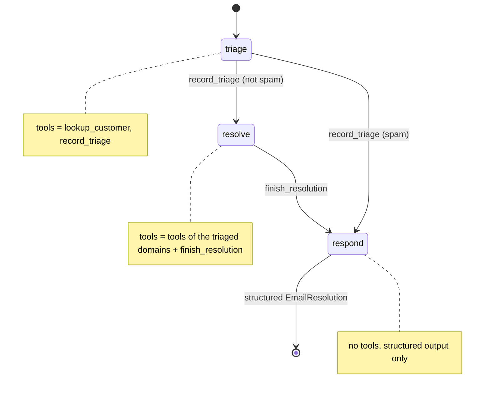

[English](../../patterns/09-state-machine.md) | Deutsch

# 9. State Machine: Handoffs innerhalb eines einzelnen Agenten

> **TL;DR** Ein Agent durchläuft benannte Schritte. Jeder Schritt hat einen
> eigenen System-Prompt, eigene Tools und erlaubte Übergänge. Tools wechseln den
> Schritt, indem sie `current_step` aktualisieren, und eine Middleware wendet
> vor jedem Modellaufruf die Konfiguration des Schritts an. Die
> LangChain-Dokumentation empfiehlt diese Variante für die meisten
> Handoff-Anwendungsfälle. Sie erzwingt eine Reihenfolge („keine Erstattung vor
> der Triage“), hält den Verlauf natürlich und braucht für Übergänge einige
> zusätzliche Aufrufe.

## Funktionsweise



```python
@wrap_model_call
def apply_step_config(request, handler):
    step = request.state.get("current_step", "triage")
    ...
    return handler(request.override(system_message=SystemMessage(prompt), tools=tools,
                                    response_format=... if final step else None))
```

- **Alle** Tools werden vorab bei `create_agent` registriert. Die Middleware
  schränkt sie nur pro Schritt ein.
- Übergangs-Tools geben
  `Command(update={"current_step": ..., "messages": [ToolMessage(...)]})`
  zurück. Die `ToolMessage` beantwortet den Tool-Aufruf.
- Strukturierte Ausgabe (`response_format`) wird nur im letzten Schritt
  angeboten. So kann der Agent nicht vorzeitig enden.
- Mit einem Checkpointer bleibt der Schritt über Gesprächsrunden hinweg
  erhalten.

## Unsere Implementierung

`src/email_assistant/native/state_machine.py`

- `triage`: den Kunden nachschlagen, dann `record_triage(category, ..., summary)`.
  Das legt die Triage im State ab (`triage`) und geht weiter.
- `resolve`: Der Prompt enthält die Triage über das Template `{triage}`. Die
  Tools sind **nur die der triagierten Domänen**, sodass eine Vertriebs-E-Mail
  kein `issue_refund` auslösen kann. `finish_resolution` geht dann weiter.
- `respond`: keine Tools, gibt `EmailResolution` zurück.

Gemessen: 6 Aufrufe pro E-Mail (Triage 2, Resolve 3, Respond 1), 3 bei Spam.
Mehr Anliegen erfordern nie mehr Aufrufe, weil Tool-Aufrufe innerhalb eines
Schritts parallel laufen.

## Stärken

- **Erzwungene Reihenfolge und minimale Rechte.** Fähigkeiten werden erst
  freigeschaltet, wenn die Vorbedingungen erfüllt sind. Das Beispiel in der
  Dokumentation erfasst den Garantiestatus, bevor eine Reparatur angeboten
  wird.
- **Natürliche Konversation.** Ein Agent und ein Verlauf, also kein Context
  Engineering für Handoffs und keine ungültigen Nachrichtenfolgen.
- **Direkte Interaktion mit dem Benutzer und Kontinuität über mehrere
  Gesprächsrunden** (der Schritt ist Teil des State).
- **Einfach.** Ein Agent plus eine Middleware statt N Graphen.

## Schwächen und Fehlermodi

- **Übergangsaufrufe kosten Modellrunden** (record, finish).
- **Das Modell kann trotzdem den falschen Übergang wählen.** Erlaubte Übergänge
  pro Schritt begrenzen den Schaden, und `Step(max_visits=...)` verhindert ein
  Hin und Her zwischen Schritten.
- **Ein gemeinsamer Kontext.** Jeder Schritt sieht alles, was vor ihm kam, und
  lange Gespräche müssen zusammengefasst werden.
- Zu viele Schritte machen daraus einen handcodierten Workflow. Schreiben Sie
  dann die [Pipeline](02-sequential-pipeline.md) explizit.

## Wann einsetzen

- Mehrstufige Gespräche: Daten erfassen, prüfen, lösen, bestätigen. Support,
  Onboarding, Schadensfälle, Bestelländerungen.
- Wenn bestimmte Tools erst unter bestimmten Bedingungen verfügbar sein dürfen
  (Compliance, Sicherheit).
- Als Standard-Implementierung für Handoffs anstelle eines
  [Swarm](08-swarm-handoffs.md).

## Wann nicht einsetzen

- Spezialisten, die selbst komplexe Graphen sind (verwenden Sie einen Swarm oder einen Supervisor).
- Parallele Arbeit über mehrere Domänen (verwenden Sie einen [Supervisor](06-supervisor.md) oder [Router](03-router.md)).

## Verwendung der Bibliothek

Die Bibliothek stellt die Middleware als `StateMachineMiddleware` bereit. Sie
lässt sich in jeden `create_agent` einsetzen oder über
`create_state_machine_agent` verwenden:

```python
from agentpatterns import Step, create_state_machine_agent, transition

@tool
def record_triage(category: str, ..., runtime: ToolRuntime):
    """Record the triage and move on."""
    return transition("resolve", runtime.tool_call_id, triage={...})   # custom transition

agent = create_state_machine_agent(
    model,
    steps=[
        Step("triage", TRIAGE_PROMPT, tools=[lookup_customer, record_triage]),
        Step("resolve", "Triage: {triage}\n...", tools=domain_tools,
             transitions=["respond"],                    # auto-generated go_to_respond(reason)
             tool_filter=only_triaged_domains),
        Step("respond", RESPOND_PROMPT, final=True),
    ],
    response_format=EmailResolution,
    state_schema=CaseState,                               # adds the `triage` key
)
```

API: [library.md](../library.md#create_state_machine_agent).

## Quellen

- LangChain-Dokumentation, *Handoffs* („single agent with middleware“ wird für
  die meisten Fälle empfohlen) und das Kundensupport-Tutorial; *Custom middleware* (`wrap_model_call`, `ModelRequest.override`).
- OpenAI, *A practical guide to building agents* (Instruktions-Templates, Guardrails).
