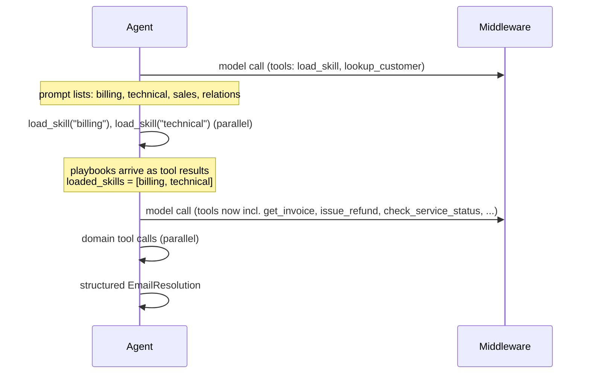

[English](../../patterns/10-skills.md) | Deutsch

# 10. Skills (schrittweise Offenlegung)

> **TL;DR** Ein Agent behält die Kontrolle. Sein Prompt listet nur *Namen und
> Beschreibungen* der Skills auf. Ein Aufruf von `load_skill(name)` holt das
> vollständige Playbook als Tool-Ergebnis in den Kontext und schaltet die Tools
> des Skills frei. Der Kontext bleibt klein, bis eine Fähigkeit gebraucht wird,
> und Teams können Skills unabhängig voneinander beisteuern. Geladene Skills
> bleiben für den Rest des Gesprächs im Kontext.

## Funktionsweise



- `load_skill` gibt ein `Command` zurück, das das Playbook (`ToolMessage`)
  hinzufügt und den Skill an `loaded_skills` anhängt.
- `loaded_skills` hat einen **zusammenführenden Reducer**, weil zwei
  `load_skill`-Aufrufe in derselben Runde sonst in Konflikt geraten würden.
- Eine `wrap_model_call`-Middleware stellt nur die Tools geladener Skills
  bereit (dynamische Tool-Registrierung).
- Das ist dieselbe Idee wie bei Anthropics Agent Skills (Metadaten, dann
  SKILL.md, dann gebündelte Dateien) und `llms.txt`.

## Unsere Implementierung

`src/email_assistant/native/skills.py`: vier Skills (billing, technical,
sales, relations), jeweils mit einem Playbook aus Richtlinienschritten und den
Tools ihrer Domäne. `lookup_customer` ist immer verfügbar.

Gemessen: **4 Aufrufe für jede E-Mail**, auch für E-1004 mit zwei Anliegen
(beide Skills parallel laden, dann parallele Lesezugriffe, parallele Aktionen,
Antwort). Das liegt gleichauf mit der Pipeline und wird nur vom Single Agent
unterboten.

## Stärken

- **Wenige Modellaufrufe.** 3 im One-Shot-Beispiel von LangChain. Das Pattern
  ist zustandsbehaftet, sodass eine wiederholte Anfrage 2 Aufrufe kostet.
- **Kleiner Basis-Prompt.** Vorab wird nur der Katalog geladen. Das hilft gegen
  „Context Rot“ und eine Überfrachtung mit Tools.
- **Verteilung auf Teams.** Skills sind Pakete aus Prompts und Tools, die
  verschiedene Teams verantworten, versionieren und reviewen können. Sie sind
  viel leichtgewichtiger als vollständige Subagenten.
- **Direkte Interaktion mit dem Benutzer.** Es bleibt ein einziger
  Gesprächs-Agent.
- **Erweiterbar.** Hierarchische Skills (Skills, die Unter-Skills offenlegen)
  und Skills, die auf später geladene Dateien oder Skripte verweisen.

## Schwächen und Fehlermodi

- **Ansammlung von Kontext.** Nach dem Laden trägt jeder weitere Aufruf alle
  geladenen Playbooks mit sich (etwa 15k gegenüber 9k Token bei Subagenten im
  domänenübergreifenden Beispiel von LangChain).
- **Keine Kontextisolation** zwischen Domänen. Ein Agent vermischt alle
  Tool-Ergebnisse.
- **Hängt davon ab, dass das Modell den richtigen Skill lädt.** Die
  Beschreibungen sind das Routing-Signal, wie bei Subagenten.
- **Keine erzwungenen Einschränkungen zwischen Skills.** Verwenden Sie die
  [State Machine](09-state-machine.md), wenn die Reihenfolge wichtig ist.

## Wann einsetzen

- Ein Agent mit **vielen möglichen Spezialisierungen**: Coding-Assistenten
  (Sprachen, Frameworks), Wissensassistenten (Domänen), Support-Desks mit
  vielen Produktlinien.
- Wenn Prompts lang sind, pro Anfrage aber nur wenige davon gebraucht werden.
- Wenn verschiedene Teams Fähigkeiten beisteuern, Sie aber den Overhead von
  Subagenten vermeiden möchten.

## Wann nicht einsetzen

- Große Kontexte pro Domäne, die alle gleichzeitig gebraucht werden und bei
  denen Isolation wichtig ist: Verwenden Sie einen [Supervisor](06-supervisor.md)
  oder [Router](03-router.md).
- Strikte Regeln zu Reihenfolge oder Berechtigungen: Verwenden Sie eine
  [State Machine](09-state-machine.md).

## Verwendung der Bibliothek

`SkillsMiddleware` funktioniert mit jedem `create_agent`. `create_skills_agent` ist die Abkürzung:

```python
from agentpatterns import Skill, create_skills_agent

agent = create_skills_agent(
    model,
    [Skill("billing", "Invoices, refunds", instructions=BILLING_PLAYBOOK, tools=BILLING_TOOLS),
     Skill("technical", "Outages, bugs", instructions=TECH_PLAYBOOK, tools=TECH_TOOLS)],
    system_prompt=SKILLS_AGENT,
    tools=[lookup_customer],          # always available
    response_format=EmailResolution,
)
```

API: [library.md](../library.md#create_skills_agent).

## Quellen

- LangChain-Dokumentation, *Skills* (Multi-Agent) und das SQL-Assistant-Tutorial;
  die Performance-Tabellen der Multi-Agent-Übersicht.
- Anthropic, *Equipping agents for the real world with Agent Skills* (2025).
- Jeremy Howard, llms.txt.
