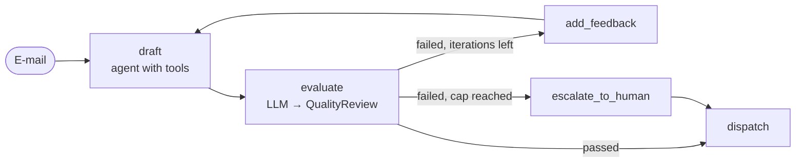

[English](../../patterns/11-evaluator-optimizer.md) | Deutsch

# 11. Evaluator-Optimizer (Reflexionsschleife)

> **TL;DR** Ein Generator erzeugt einen Kandidaten. Ein Evaluator bewertet ihn
> mit strukturierter Ausgabe anhand expliziter Kriterien, und durchgefallene
> Kandidaten gehen zusammen mit dem Feedback an den Generator zurück. Das
> wiederholt sich, bis der Kandidat besteht oder eine Obergrenze an Iterationen
> erreicht ist. Das hebt die Qualität, wenn die Kriterien klar und prüfbar
> sind. Es vervielfacht Kosten und Latenz und braucht eine Obergrenze und einen
> Fallback.

## Funktionsweise



- Der Evaluator gibt `QualityReview(passed, score, issues, feedback)` über
  `with_structured_output` zurück.
- Das Feedback wird als `HumanMessage` an die **eigene Konversation des
  Generators** angehängt. Der Entwurfs-Agent behält seine Tool-Ergebnisse,
  sodass eine Überarbeitung einen Aufruf kostet, statt die Recherche zu
  wiederholen.
- Eine feste Obergrenze (`MAX_ITERATIONS = 3`) und ein sicherer Fallback (an
  einen Menschen eskalieren, nie einen durchgefallenen Entwurf versenden).

Microsoft nennt das *Maker-Checker*, „auch bekannt als Evaluator-Optimizer,
Generator-Verifier, Critic Loops oder Reflection Loops“.

## Unsere Implementierung

`src/email_assistant/native/evaluator_optimizer.py`

Der Reviewer prüft die Hausregeln: Ansprache des Kunden mit Vornamen, Nennung
jeder Referenznummer (Erstattung, Ticket, Lead, Eskalation), eine
Entschuldigung bei frustrierten Kunden, die Signatur, keine internen
Informationen (Tier) und niemals eine bestätigte Datenlöschung.

Um die Schleife zu testen, schreibt der Mock-Entwurfs-Agent einen hastigen
ersten Entwurf („Hi, we have looked into your request ...“). Der Reviewer lehnt
ihn mit konkreten Mängeln ab. Der zweite Entwurf besteht:

```
iteration 1: failed - Address the customer by name (Anna). Mention the reference number(s) RF-2158 ...
iteration 2: passed
```

Gemessen: 6 Aufrufe (3 Entwurf + 1 Review + 1 Überarbeitung + 1 Review); Spam 2.

## Stärken

- **Qualität dort, wo Kriterien explizit sind.** Self-Refine berichtet von etwa
  20 % absoluter Verbesserung. Reflexion erreichte 91 % pass@1 auf HumanEval.
  Laut dem Bericht von Cognition aus 2026 finden Review-Schleifen etwa 2 Bugs
  pro PR, davon etwa 58 % schwerwiegend.
- **Trennung von Erzeugung und Prüfung.** Der Bewerter kann ein anderes,
  günstigeres Modell sein oder sogar Code (Tests, Schema-Validierung, eine
  Policy-Engine). Cognition stellte fest, dass Reviewer am besten **ohne**
  gemeinsamen Kontext mit dem Generator arbeiten.
- **Eingebautes Quality Gate.** Zusammen mit einem Fallback erreichen schlechte
  Ausgaben nie den Kunden.

## Schwächen und Fehlermodi

- **Keine Konvergenz.** Die Schleife oszilliert oder erfüllt eine vage
  Bewertungsrubrik nie. Begrenzen Sie sie immer und definieren Sie einen
  Fallback.
- **Nachsichtige oder gefällige Bewerter** winken schlechte Ausgaben durch,
  übermäßig strenge verbrennen Budget. Kalibrieren Sie den Bewerter an
  gelabelten Beispielen.
- **Kosten ≈ k × (Erzeugen + Bewerten)**, dazu Latenz pro Iteration.
- **Vage Kriterien erzeugen vages Feedback.** Formulieren Sie Rubriken konkret
  und prüfbar.

## Wann einsetzen

- Klare, prüfbare Kriterien: Stil- und Richtlinienregeln, Format,
  Übersetzungstreue, Code, der Tests bestehen muss, juristische Formulierungen.
- Ausgaben mit hoher Tragweite, bei denen ein zweiter Blick günstiger ist als
  ein Fehler.
- Um jedes andere Pattern herum: In unserem Composite ist der Router der
  Generator.

## Wann nicht einsetzen

- Keine aussagekräftigen Kriterien (subjektiver Geschmack): Sie bezahlen für
  Rauschen.
- Latenzkritische Interaktionen.
- Wenn ein deterministischer Validator genügt. Verwenden Sie stattdessen ein
  Gate in einer [Pipeline](02-sequential-pipeline.md).

## Verwendung der Bibliothek

```python
from agentpatterns import create_evaluator_optimizer

loop = create_evaluator_optimizer(
    drafter,                           # generator: any agent-contract runnable (agent, router, supervisor, ...)
    model,                             # evaluator: a chat model (can be cheaper) or an agent with tools
    evaluator_prompt=REVIEWER,
    evaluation_schema=QualityReview,   # needs a boolean `passed` (or pass `passed=`)
    max_iterations=3,
    on_max_iterations=lambda draft, review: escalate(draft, review),
)
```

Die Ausgabe enthält `structured_response`, `evaluation` und `iterations`. API:
[library.md](../library.md#create_evaluator_optimizer).

Wenn der Generator selbst ein Pattern ist (zum Beispiel ein Orchestrator mit
Recherche-Subagenten), liegt seine Arbeit außerhalb von `messages`. Übergeben
Sie `carry_over=["results"]`, damit Überarbeitungen auf der bisherigen
Recherche aufbauen, statt sie zu wiederholen, und `evaluator_context=`, damit
der Reviewer die Belege sieht. Siehe das
[Rezept „Recherche mit Review“](../library.md#rezept-recherche-mit-review).

## Quellen

- Anthropic, *Building effective agents* (Evaluator-Optimizer).
- LangGraph-Dokumentation, *Workflows and agents* (Evaluator-Optimizer-Beispiel).
- Microsoft, *Maker-checker* (Iterationsobergrenzen, Fallbacks).
- Madaan et al., *Self-Refine* (2023); Shinn et al., *Reflexion* (2023);
  Cognition, *Multi-agents: what's actually working* (2026).
