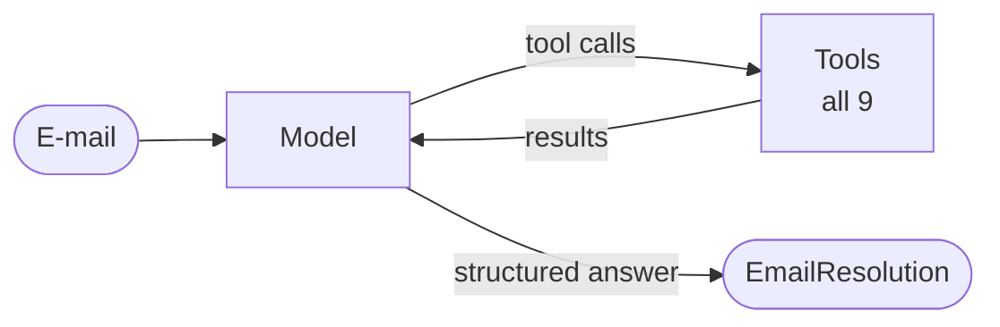

English | [Deutsch](../de/patterns/01-single-agent.md)

# 1. Single agent (the baseline)

> **TL;DR** One LLM in a tool-calling loop owns the whole task. It is the
> simplest, cheapest and easiest pattern to debug, and every multi-agent design
> has to beat it. It degrades when there are too many or overlapping tools, or
> when the context grows with irrelevant material.

## How it works



The agent repeats *think → call tools (possibly several in parallel) →
observe* until it answers without a tool call. With `response_format` the loop
ends when the model calls the structured-output tool (or returns native
structured output). All state is a single message history.

Anthropic calls this building block the *augmented LLM* (model + tools +
retrieval + memory). OpenAI's guide says to "maximize a single agent's
capabilities first".

## Our implementation

`src/email_assistant/native/single_agent.py`

```python
agent = create_agent(
    model,
    tools=ALL_TOOLS,                               # 5 read + 4 write tools
    system_prompt=prompts.SINGLE_AGENT,
    response_format=EmailResolution,               # -> result["structured_response"]
    middleware=[ModelCallLimitMiddleware(run_limit=15, exit_behavior="error")],
    name="customer_service_agent",
)
```

The graph node maps the workflow state (`email`) to the agent contract
(`messages`) and back. That is the documented "call a subgraph inside a node"
technique for differing schemas.

Trace for E-1004 (two intents), 3 model calls:

1. parallel reads: `lookup_customer`, `get_invoice`, `check_service_status`,
   `search_knowledge_base` ×2
2. parallel actions: `create_ticket(billing)`, `create_ticket(technical)`
3. structured `EmailResolution`

This was the cheapest pattern in our measurement (16 model calls for the whole
inbox). The same speed would hold with a real model; its weaknesses would be
reliability issues.

## Strengths

- Minimal moving parts: one prompt, one loop, one trace.
- Continuous context: the agent remembers everything it did, with no handoff
  loss. Cognition's argument in "Don't build multi-agents" is that single-
  threaded agents avoid the conflicting implicit decisions that parallel agents
  make.
- Parallel tool calls give much of the speed benefit of parallel agents for
  I/O-bound lookups.
- Cheapest in calls and latency for short tasks.

## Weaknesses and failure modes

- **Tool overload.** OpenAI's guide observes that some agents manage over 15
  well-defined tools while others struggle with fewer than 10 overlapping ones.
  LangChain's benchmark found the single agent degrading sharply once two or
  more distractor domains were added.
- **Context rot.** Every tool result stays in the history, relevant or not;
  token use grows over the run, and a long playbook for every domain has to sit
  in one prompt.
- **No separation of concerns.** One prompt holds all policies. Different teams
  cannot own different parts, and a change for billing can break sales.
- **Weak guarantees.** Nothing forces the order "look up, then act" except the
  prompt (compare the [state machine](09-state-machine.md)).

## Cost and latency

Lowest overhead per step. Tokens grow with the number of tool definitions ×
calls and with history length. Anthropic reports that agents use about 4× the
tokens of chat interactions; multi-agent systems use about 15×.

## When to use

- A single domain, or a few domains with **distinct, well-described tools**
  (fewer than about 10-15).
- Tasks where the context the agent collects is relevant to the whole task.
- As the **baseline** in every evaluation. Microsoft calls it "often the right
  default for enterprise use cases".

## When not to use / when to move on

- Tool-selection errors show up in traces, or the prompt becomes a policy
  handbook. Try [skills](10-skills.md) or `LLMToolSelectorMiddleware` first,
  then a [router](03-router.md) or [supervisor](06-supervisor.md).
- Security boundaries: some tools must not be callable in certain contexts
  (compare [state machine](09-state-machine.md)).
- Large independent sub-tasks that would benefit from isolated contexts.

## Hardening checklist

- `ModelCallLimitMiddleware` / `ToolCallLimitMiddleware` against runaway loops
  (`max_model_calls` / `max_tool_calls` in the library, `loop_limits()` for a plain `create_agent`).
- Write tools that enforce policy themselves (our `issue_refund` rejects
  amounts over 500 EUR and duplicate refunds).
- `HumanInTheLoopMiddleware(interrupt_on={...})` for risky tools (requires a checkpointer).
- `SummarizationMiddleware` for long conversations.

## Using the library

```python
from agentpatterns import create_single_agent

agent = create_single_agent(model, tools, system_prompt="...", response_format=Resolution,
                            max_model_calls=15, max_tool_calls=30)
```

See [library.md](../library.md#create_single_agent).

## Sources

- Anthropic, *Building effective agents* (2024): augmented LLM; start simple.
- OpenAI, *A practical guide to building agents*: maximize a single agent first; tool-count observations.
- LangChain, *Benchmarking multi-agent architectures* (2025): single agent degrades with distractor domains.
- Microsoft, *AI agent orchestration patterns*: single agent as the enterprise default.
- Cognition, *Don't build multi-agents* (2025).
