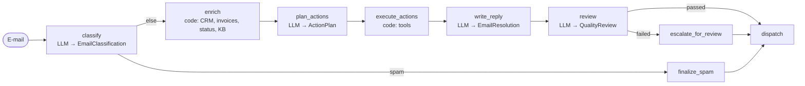

English | [Deutsch](../de/patterns/02-sequential-pipeline.md)

# 2. Sequential pipeline (prompt chaining)

> **TL;DR** A fixed sequence of steps: single LLM calls with structured output,
> deterministic code, and gates in between. The graph decides what happens
> next, not the model. It is predictable, auditable and cheap in tokens, but
> rigid, and errors in early steps carry forward.

## How it works



Each LLM step is one `model.with_structured_output(Schema).invoke(...)`
without a tool loop. Steps communicate through typed graph state. Gates are
plain Python predicates on conditional edges. Microsoft calls this *sequential
orchestration*, "also known as pipeline, prompt chaining, or linear
delegation".

## Our implementation

`src/email_assistant/native/sequential.py`

Key design decision: **the model proposes, code disposes.** The action planner
returns a typed `ActionPlan`: a discriminated union of `RefundAction`,
`TicketAction`, `LeadAction` and `EscalationAction`. The `execute_actions`
node runs them through the same policy-enforcing tools. This is also the
natural place for a human approval step.

```python
planner = model.with_structured_output(ActionPlan)

def execute_actions(state):
    for action in state["plan"].actions:
        tool = ACTION_TOOL[action.kind]
        executed.append({"tool": tool, "args": ..., "result": TOOLS[tool].invoke(args)})
```

Retrieval (`enrich`) is deterministic code: sender, then CRM; invoice IDs
found by regex, then billing; services mentioned, then status page. No LLM
decides which systems to query.

Two gates:

1. Spam never reaches the expensive steps (1 model call for E-1005).
2. A failed quality review never auto-sends; it escalates instead.

Measured: 4 model calls per e-mail independent of the number of intents, and
the **fewest tokens** of all patterns (16.9k for the inbox), because every call
carries only the facts it needs and no tool-call history.

## LangGraph notes

- Plain `StateGraph` with `add_edge` / `add_conditional_edges`.
- The docs' "custom workflow" pattern: any node can also be a `create_agent`
  (see the `agent_step` in the library, used in our parallel and composite workflows).
- Put structured outputs in state (Pydantic objects), not free text, so the
  next step and the gates can use them directly.

## Strengths

- **Predictable and testable.** Each step can be unit-tested and evaluated on
  its own; the graph documents the process.
- **Auditability and compliance.** You know exactly which step made which
  decision, and gates enforce hard rules.
- **Cheap models per step.** The classifier can be a small model and only the
  writer needs a strong one. Anthropic: prompt chaining trades latency for accuracy.
- **Smallest context per call.**

## Weaknesses and failure modes

- **Rigid.** Anything the designer did not anticipate (a third intent, an
  unknown system) is not handled. There is no backtracking unless you model it.
- **Early errors propagate.** A wrong classification leads to wrong retrieval,
  which leads to a wrong plan. Add gates and validation.
- **Sequential latency.** N steps mean N round trips, and there is no
  parallelism unless you combine it with [parallelization](04-parallelization.md).
- **Glue code.** Every step needs a prompt builder and state wiring (the
  library's `create_pipeline` removes most of it).

## When to use

- The process is **known and stable**: document processing, form handling,
  translate-then-check, e-mail triage with a fixed policy.
- Regulated domains where every decision must be traceable.
- Cost-sensitive high-volume workloads.

## When not to use

- Tasks with open-ended exploration or unknown numbers of steps (use
  [orchestrator-workers](05-orchestrator-workers.md) or an agent).
- Embarrassingly parallel stages (use [parallelization](04-parallelization.md)).
- Microsoft: avoid it when the flow needs backtracking, iteration or dynamic routing.

## Using the library

```python
from agentpatterns import create_pipeline, llm_step, function_step

pipeline = create_pipeline([
    llm_step("classify", model, system_prompt=CLASSIFIER, output_schema=EmailClassification,
             gate=lambda s: s["outputs"]["classify"].category != "spam",
             on_gate_fail=lambda s: ignore_resolution(s)),
    function_step("enrich", enrich),            # deterministic, reads s["context"]
    llm_step("plan_actions", model, system_prompt=ACTION_PLANNER, output_schema=ActionPlan),
    function_step("execute_actions", execute_actions),
    llm_step("write_reply", model, system_prompt=REPLY_WRITER, output_schema=EmailResolution),
    llm_step("review", model, system_prompt=REVIEWER, output_schema=QualityReview,
             gate=lambda s: s["outputs"]["review"].passed, on_gate_fail=escalate),
], output="write_reply")
```

Full example: `src/email_assistant/library_based/sequential.py`. API: [library.md](../library.md#create_pipeline).

## Sources

- Anthropic, *Building effective agents*: prompt chaining with programmatic gates.
- LangGraph docs, *Workflows and agents*: prompt chaining example.
- LangChain docs, *Custom workflow* (multi-agent): mixing deterministic and agentic nodes.
- Microsoft, *AI agent orchestration patterns*: sequential orchestration, when to avoid it.
