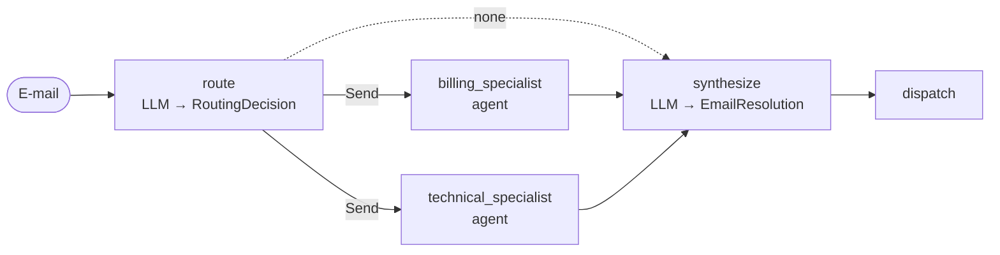

# 3. Router

> **TL;DR** A single routing step (an LLM with structured output, or rules)
> classifies the input and dispatches it to specialized agents: zero, one or
> several in parallel. A synthesizer merges the results. It is cheap and
> transparent, and each specialist gets a small, focused context. But the
> routing decision is made once, and a misroute is final.

## How it works



1. `route` returns `RoutingDecision(routes=[Route(agent, task), ...])`. The
   `agent` field is a `Literal` of the known specialists (an enum constraint),
   so the model cannot invent agents.
2. A conditional edge returns one `Send(agent, {"task": ...})` per route. The
   selected specialists run **in parallel** in the same super-step, each with
   its own private input.
3. Specialists write to a shared `reports` key that has an `operator.add`
   reducer, which parallel writes require.
4. `synthesize` merges the reports into one reply.

## Our implementation

`src/email_assistant/native/router.py`

```python
class Route(BaseModel):
    agent: Literal["billing_specialist", "technical_specialist", "sales_specialist", "relations_specialist"]
    task: str

def fan_out(state):
    if not state["routes"]:
        return "synthesize"
    return [Send(r.agent, {"task": r.task}) for r in state["routes"]]
```

Specialists are `create_agent`s with only their domain tools (4-5 instead of
9) and return a structured `SpecialistReport` (findings, actions with
reference numbers, and a paragraph for the customer).

Measured: 5 calls for single-intent e-mails (1 route + 3 specialist + 1
synthesis) and 8 for the two-intent E-1004, where both specialists run
concurrently. Spam costs 2 calls (route to nobody, then the synthesizer
decides "ignore").

## Router vs. supervisor

Both can dispatch to several agents. The difference, as the LangChain docs
describe it: a router is a single classification step without conversation
state; a supervisor is a full agent that keeps context and can decide again
after seeing results. Use a router when **input categories are clear**; use a
[supervisor](06-supervisor.md) when the next step depends on what came back.

## Stateless vs. stateful

Routers are stateless and pay the routing call on every turn. The LangChain
docs show 6 calls for a repeated request, against 5 for handoffs or skills.
For chat, wrap the router as a tool of a conversational agent, which keeps the
memory while the router stays stateless:

```python
search = agent_as_tool(AgentSpec("help_desk", "Answers product questions", router))
chat = create_agent(model, tools=[search], checkpointer=InMemorySaver())
```

## Strengths

- **Cheap, fast dispatch.** The routing call can use a small model; Anthropic's
  example routes easy questions to Haiku and hard ones to a stronger model.
- **Context isolation per vertical.** Each specialist sees only its task and
  tools. That helps most with large per-domain context (LangChain: about 9k vs.
  15k tokens against skills in their multi-domain example).
- **Parallel multi-intent handling** via `Send`.
- **Transparent.** The routing decision is a structured object you can log,
  evaluate and test.

## Weaknesses and failure modes

- **Misrouting is final.** Nothing re-routes if a specialist finds the request
  was not for it. Mitigations: a fallback route, a "general" agent,
  confidence thresholds, or a supervisor instead.
- **The task text is the only context.** The router has to write
  self-contained tasks; lossy tasks cause poor specialist results.
- **Synthesis step.** It adds one call and a second chance to lose details
  (skip it for single-route answers; the library does so by default when no
  structured output is requested).
- **Repeated routing cost** in multi-turn use (see above).

## When to use

- Distinct **verticals** that each need their own prompt, tools or knowledge:
  billing / tech / sales, HR / IT / legal, or several knowledge sources.
- Inputs that can contain several requests that can be handled independently.
- When you want deterministic, rule-based routing (library: `route_fn=`).

## When not to use

- The right handler only emerges while working (use a [supervisor](06-supervisor.md)).
- Specialists need to talk to the user over several turns (use [handoffs](09-state-machine.md)).
- A single domain (a router adds a hop for nothing).

## Using the library

```python
from agentpatterns import AgentSpec, create_router

router = create_router(
    model,
    [AgentSpec("billing_specialist", "Invoices, refunds", billing_agent),
     AgentSpec("technical_specialist", "Outages, bugs", tech_agent)],
    system_prompt=ROUTER, synthesizer_prompt=REPLY_WRITER, response_format=EmailResolution,
)
```

Full example: `src/email_assistant/library_based/router.py`. API: [library.md](../library.md#create_router).

## Sources

- Anthropic, *Building effective agents*: routing to specialized prompts and models.
- LangChain docs, *Router* (multi-agent), *Workflows and agents* (routing), and the router knowledge-base tutorial (`Send`).
- LangChain docs, multi-agent overview: performance tables (one-shot, repeat request, multi-domain).
- Microsoft: prefer deterministic routing when the handler is identifiable from the input.
