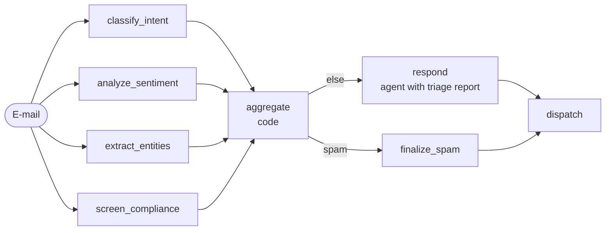

# 4. Parallelization (fan-out / fan-in)

> **TL;DR** Several branches run at the same time and their results are merged.
> There are three flavours: **sectioning** (different sub-tasks on the same
> input), **voting** (the same task N times, majority wins) and **map-reduce**
> (the same task over N items). This cuts latency and adds robustness, but it
> multiplies cost and needs a merge rule.

## How it works



- **Static fan-out:** several `add_edge(START, branch)`; LangGraph runs them in
  the same super-step.
- **Fan-in:** `add_edge([b1, b2, b3, b4], "aggregate")` waits for *all*
  branches.
- **Dynamic fan-out** (voting, map-reduce): a conditional edge returns a list
  of `Send(node, private_input)`.
- **State:** branches write different keys, or a shared key with a reducer
  (`operator.add`, dict merge). Without a reducer, parallel writes to one key
  raise `InvalidUpdateError`.

## Our implementation

`src/email_assistant/native/parallel.py`

**Sectioning:** four analysts (intent, sentiment, entities, compliance), each
a single structured-output call, look at the e-mail simultaneously. Plain code
merges them into a triage report. For example, the compliance screen can
override the category to spam, and priority is the maximum of intent and
urgency. A responder agent then resolves the e-mail with the triage report in
its prompt. This is the "guardrail running beside the main task" idea from
Anthropic's guide.

**Map-reduce:** `build_inbox_digest_graph(per_email_workflow)` sends every
e-mail of the inbox to any per-e-mail workflow (any pattern) in parallel and
reduces the results to a digest (counts by category and status, urgent,
escalated).

```python
def fan_out(state):
    return [Send("process_email", {"email": e}) for e in state["emails"]]
```

Measured: 7 calls per e-mail (4 analysts + 3 responder) regardless of intents;
spam still costs 4 because the fan-out happens before the gate. Latency is
about one analyst call instead of four sequential ones.

## Strengths

- **Latency.** Wall-clock time is roughly the slowest branch. Anthropic's
  research system cut research time by up to 90% with parallel subagents and
  parallel tool calls.
- **Separation of concerns.** Each analyst has one narrow job and prompt, is
  easy to evaluate, and can run on a smaller model.
- **Robustness.** Voting reduces variance, and independent guardrails catch
  what the main path misses.
- **Batch throughput.** Map-reduce over thousands of items, with any workflow as the mapper.

## Weaknesses and failure modes

- **Cost multiplies:** N branches mean N× tokens, and every branch runs even
  when not needed (spam paid for four analysts here).
- **Merge conflicts:** branches may disagree (the intent analyst says billing,
  compliance says phishing). You need an explicit precedence rule, voting or an
  LLM synthesizer.
- **Rate limits and quotas** when fanning out widely. Cap the fan-out width.
- **Not for dependent steps.** If B needs A's output, use a
  [pipeline](02-sequential-pipeline.md) or an [orchestrator](05-orchestrator-workers.md).
- Microsoft warns against shared mutable state between concurrent agents.

## When to use

- Independent analyses of the same input (classification, extraction,
  compliance, sentiment).
- Guardrails running concurrently with generation.
- Voting when a single call is too unreliable and the answer is discrete
  (category, yes/no, severity).
- Batch or back-office processing (map-reduce), for example nightly inbox digests.

## When not to use

- Steps depend on each other.
- Budget-critical workloads where most branches would be wasted. Consider a
  [router](03-router.md) that only starts the needed branches.

## Using the library

```python
from agentpatterns import AgentSpec, create_parallel, create_voting, create_map_reduce

triage = create_parallel([intent, sentiment, entities, compliance],
                         aggregator=lambda results, state: merge(results))
robust = create_voting(AgentSpec("classifier", "...", classifier_agent), n=5,
                       key=lambda r: r.structured.category)
digest = create_map_reduce(email_workflow, prepare=lambda e: {"email": e},
                           extract=summarize, reduce=build_digest)
```

`src/email_assistant/library_based/parallel.py` shows sectioning composed into
a pipeline (triage, a spam gate, then respond). `composite.py` shows
map-reduce over the inbox. API: [library.md](../library.md#create_parallel).

## Sources

- Anthropic, *Building effective agents*: sectioning and voting;
  *Multi-agent research system*: parallelism cut time by up to 90%.
- LangGraph docs, *Workflows and agents* (parallelization) and *Graph API* (`Send`, reducers).
- Microsoft, *Concurrent orchestration* (fan-out/fan-in, scatter-gather, map-reduce).
- Du et al. (2023), multi-agent debate / voting for reasoning quality.
