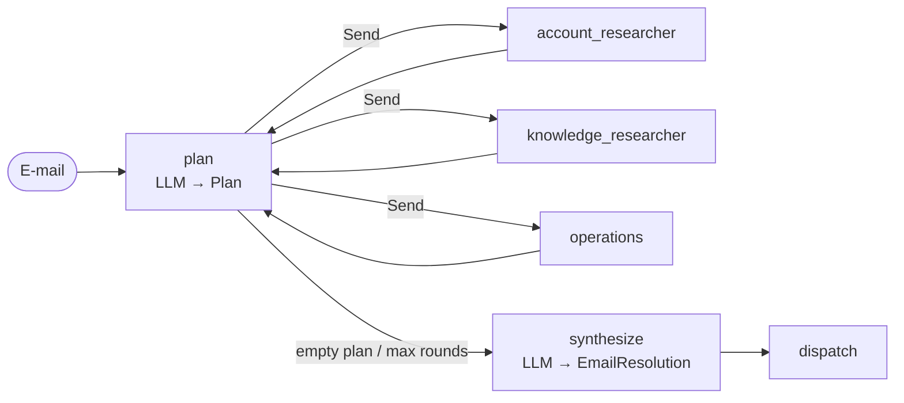

English | [Deutsch](../de/patterns/05-orchestrator-workers.md)

# 5. Orchestrator-workers (and plan-and-execute)

> **TL;DR** An orchestrator LLM decomposes the job into tasks *at runtime*
> (structured output), workers execute them in parallel, and the orchestrator
> can re-plan with the results (research first, then act) before a synthesizer
> writes the answer. It is flexible where sub-tasks cannot be predefined, and
> the plan is explicit and inspectable. It costs more calls and depends on
> good planning.

## How it works



- The planner returns `Plan(tasks=[PlannedTask(worker, instruction), ...])`,
  where `worker` is a `Literal` of the worker names.
- `Send` starts one worker per task. The same worker type can receive several
  tasks, which a router cannot do.
- Workers append `{"worker", "instruction", "output"}` to a reducer key.
- **Re-planning:** workers flow back into `plan`. The planner sees all results
  and returns more tasks or an empty list (done). A round cap (`MAX_ROUNDS`)
  bounds the loop.

Anthropic describes the pattern this way: "the key difference from
parallelization is its flexibility — subtasks aren't pre-defined, but
determined by the orchestrator". With re-planning it becomes
*plan-and-execute* (LangChain blog 2024; Microsoft's "magentic"
orchestration with a task ledger).

## Our implementation

`src/email_assistant/native/orchestrator.py`

The workers are **functional**, not domain experts: an account researcher
(CRM, invoices), a knowledge researcher (KB, status, pricing) and an operations
agent (all write tools). This is what makes the planning visible:

| Round | Plan for E-1004 |
|---|---|
| 1 | account_researcher: `lookup_customer`, `get_invoice(INV-2026-0901)`; knowledge_researcher: `check_service_status(export)`, two KB searches |
| 2 | operations: `create_ticket(billing, ...)`, `create_ticket(technical, ...)`, derived from round-1 results |
| 3 | empty plan, then synthesize |

The planner writes explicit instructions ("Call create_ticket with {...}").
Explicit tasks help: Anthropic's research system found vague delegation led to
duplicated work and gaps.

Measured: 10 calls per e-mail (3 planning + 2×2 research + 2 operations + 1
synthesis). This is the most expensive pattern in calls, independent of
intents; spam costs 2 (empty plan, then synthesize).

## LangGraph notes

- Planning: `model.with_structured_output(Plan)` (the library uses the
  provider's native structured output where available).
- Fan-out: a conditional edge returning `[Send(worker, {...}) for task in plan]`.
- The loop back to the planner is an ordinary edge; the round counter lives in state.
- Nested structured plans (a list of Pydantic models with `Literal` fields) work
  with both tool-calling and native structured output.

## Orchestrator vs. router vs. supervisor

| | Router | Orchestrator-workers | Supervisor |
|---|---|---|---|
| Decision | classify the input once | decompose into tasks; optionally re-plan | agent loop: delegate, observe, decide |
| Plan visible in state | routes | **yes, `plan` + `results`** | only in messages |
| Same worker multiple times | no | **yes** | yes |
| Control flow | graph | graph + planning loop | model |

## Strengths

- **Handles unknown sub-tasks.** The number and type of tasks follow the input
  and the intermediate results.
- **Explicit, auditable plan.** You can log it, validate it before execution
  (for example "operations tasks need approval") or let a human edit it.
- **Parallel workers** with isolated contexts; workers can use cheaper models
  ("the larger agent doesn't need to be consulted after each action",
  LangChain's plan-and-execute post).
- **Separation of thinking and doing.** Read-only research runs before writes.

## Weaknesses and failure modes

- **Planner quality is critical.** Bad decomposition leads to duplicated or
  missing work. Microsoft notes magentic-style managers can be slow to converge
  and stall on ambiguous goals.
- **Latency of rounds.** Each round is plan, then the slowest worker.
- **Stale plans.** Without re-planning, a plan cannot react to surprises.
- **Most calls** in our comparison, and its cost varies more than any other pattern's.

## When to use

- Tasks whose sub-tasks depend on the input and on earlier results: research,
  multi-file changes, case handling with a "research, then act" structure.
- When you want an inspectable plan (compliance, approval of plans, debugging).
- Long tasks where a planner model coordinates cheaper executor models.

## When not to use

- Fixed processes (use a [pipeline](02-sequential-pipeline.md)); clear
  categories (use a [router](03-router.md)).
- Short interactive tasks where the extra planning rounds hurt latency.

## Using the library

```python
from agentpatterns import AgentSpec, create_orchestrator

orchestrator = create_orchestrator(
    model,
    [AgentSpec("account_researcher", "CRM and billing lookups", account_agent),
     AgentSpec("knowledge_researcher", "KB, status, pricing", knowledge_agent),
     AgentSpec("operations", "Side-effect actions", ops_agent)],
    planner_prompt=PLANNER, synthesizer_prompt=REPLY_WRITER,
    response_format=EmailResolution, max_rounds=3,
)
```

Earlier work can be passed in as `results`; the planner then plans only what
is missing. That is how an orchestrator inside a review loop revises its
research instead of repeating it: see the
[research-with-review recipe](../library.md#recipe-research-with-review).

API: [library.md](../library.md#create_orchestrator).

## Sources

- Anthropic, *Building effective agents* (orchestrator-workers); *Multi-agent research system* (explicit delegation, effort scaling, token costs).
- LangGraph docs, *Workflows and agents*: orchestrator-worker with `Send`.
- LangChain blog, *Plan-and-Execute Agents* (2024): ReWOO, LLMCompiler.
- Microsoft, *Magentic orchestration*.
