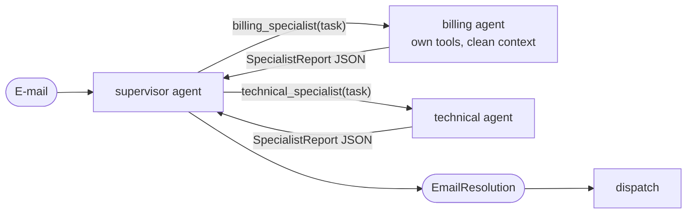

# 6. Supervisor with subagents as tools

> **TL;DR** A main agent (the supervisor) calls specialized subagents **as
> tools**. It decides whom to call with which task, possibly several in
> parallel, sees their results, and composes the answer. This is LangChain v1's
> recommended multi-agent default: central control, strong context isolation,
> easy team ownership. It costs one extra hop, and results pass through the
> supervisor ("telephone game").

## How it works



- Each subagent is a `create_agent` wrapped in a `@tool`. Its name and
  description are the routing signal.
- **Input** (context engineering): by default only the task text, so the
  subagent starts with a clean context window. Alternatively *fork* the
  parent's conversation into the subagent (Deep Agents calls these modes
  `isolated` and `fork`).
- **Output:** only the subagent's final result goes back; its internal tool
  calls stay private. We return the structured `SpecialistReport` as JSON, so
  the supervisor gets facts instead of prose.
- Parallel tool calls let the supervisor consult several subagents in one turn.

The LangChain docs state that *"the langgraph-supervisor package is no longer
actively maintained"* and recommend this pattern instead. Unlike the old
handoff-based supervisor, workers are not graph nodes that hand control back;
they are tools.

## Our implementation

`src/email_assistant/native/supervisor.py`

```python
def make_specialist_tool(model, domain):
    specialist = create_agent(model, tools=DOMAIN_TOOLS[domain], system_prompt=prompts.SPECIALISTS[domain],
                              response_format=SpecialistReport, name=f"{domain}_specialist")

    @tool(f"{domain}_specialist", description=prompts.SPECIALIST_DESCRIPTIONS[domain])
    def call_specialist(task: str) -> str:
        result = specialist.invoke({"messages": [HumanMessage(task)]})
        return result["structured_response"].model_dump_json()
    return call_specialist

supervisor = create_agent(model, tools=[make_specialist_tool(model, d) for d in DOMAIN_TOOLS],
                          system_prompt=prompts.SUPERVISOR, response_format=EmailResolution)
```

For E-1004 the supervisor issues `billing_specialist(...)` and
`technical_specialist(...)` as **parallel tool calls** (the tools run
concurrently), then merges both reports into one reply.

Measured: 5 calls for single-intent e-mails (delegate + 3 specialist +
compose), 8 for two intents, 1 for spam (the supervisor answers "ignore"
directly without delegating).

## Design decisions (from the LangChain docs)

| Decision | Options | Our choice |
|---|---|---|
| Tool pattern | tool per agent / single `task(agent_name, description)` dispatch tool | tool per agent (the library supports both) |
| Subagent specs | system prompt / enum constraint / discovery tool | tool descriptions + catalog in the prompt |
| Inputs | query only (isolated) / full context (fork) | isolated |
| Outputs | final message / structured / extra state via `Command` | structured report |
| Sync vs. async | blocking / background jobs with status tools | blocking |

## Strengths

- **Central control and flexibility.** The supervisor can call several
  subagents, call them again, or answer itself, all adaptively.
- **Context isolation.** Subagents may use thousands of tokens internally but
  return a compact result. LangChain measured 67% fewer tokens than skills in a
  multi-domain example. Anthropic's lead-plus-subagents research system beat a
  single agent by 90.2% on its internal eval.
- **Distributed development.** Teams own subagents independently, and it works
  with third-party agents because it "makes the fewest assumptions about the
  underlying agents" (LangChain benchmark).
- **Parallelism** via parallel tool calls.

## Weaknesses and failure modes

- **Telephone game.** The supervisor rephrases subagent output. LangChain fixed
  this with a `forward_message` tool, removing handoff messages from subagent
  context and tuning tool names, which gave nearly 50% improvement. Structured
  reports help as well.
- **Extra hop.** 4 vs. 3 calls in LangChain's one-shot example, and it repeats
  on every request because subagents are stateless (8 calls over two turns vs. 5 for handoffs).
- **Subagents that don't report.** The docs warn that a subagent may do the
  work but leave the results out of its final message. Use structured output
  or explicit prompting ("the coordinator only sees your final report").
- **Vague delegation.** Tasks need an objective, the context, output
  expectations and boundaries.
- **No direct user interaction** from subagents, except via `interrupt()`.

## When to use

- **Several distinct domains** (calendar, e-mail, CRM, billing) with no need
  for subagents to converse with the user.
- Parallel multi-domain work, research-style breadth-first tasks.
- Team-owned or third-party agents behind a stable tool interface.
- As the default when a single agent is no longer enough.

## When not to use

- Only a few tools: use a [single agent](01-single-agent.md).
- The specialist must hold a multi-turn conversation with the user: use
  [handoffs](09-state-machine.md).
- Tightly coupled writes where agents must share all context. Cognition's 2026
  follow-up recommends single-threaded writes with helper agents that only read.

## Operational notes

- Subagents inherit the parent's checkpointer per invocation, so `interrupt()`
  inside a subagent works if the outer graph has a checkpointer.
- Subagents called inside tools are not statically discoverable, so
  `get_state(subgraphs=True)` does not show them. Call them from graph nodes if
  you need that.
- Cap the supervisor's loop (`max_model_calls`) and, if needed, how often each
  subagent may be called (`max_calls_per_agent`). Subagent limits apply per
  call, so use a `RunBudget` to cap the total.

## Using the library

```python
from agentpatterns import AgentSpec, create_supervisor

supervisor = create_supervisor(
    model,
    [AgentSpec("billing_specialist", "Invoices, refunds", billing_agent), ...],
    system_prompt=SUPERVISOR,
    response_format=EmailResolution,
    delegation="tool_per_agent",   # or "task_tool"
    input_mode="task",             # or "fork"
)
```

API: [library.md](../library.md#create_supervisor).

## Sources

- LangChain docs, *Subagents* (multi-agent); *Migrate from langgraph-supervisor*; *Subgraph persistence*.
- LangChain blog, *Benchmarking multi-agent architectures* (supervisor fixes, about 50%).
- Anthropic, *How we built our multi-agent research system* (+90.2%, about 15× tokens, delegation quality).
- OpenAI Agents SDK: agents as tools vs. handoffs.
