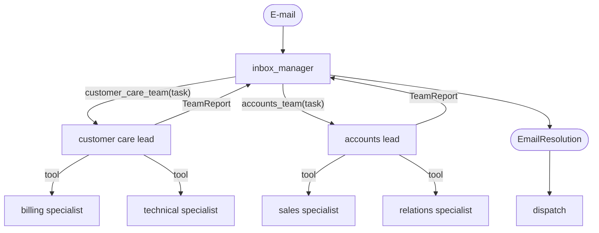

English | [Deutsch](../de/patterns/07-hierarchical.md)

# 7. Hierarchical teams (supervisor of supervisors)

> **TL;DR** The supervisor pattern, nested: a top-level agent delegates to team
> leads, which delegate to their members. Each supervisor sees only a few tools,
> so the design scales to many agents and mirrors the organisation. Every level
> adds latency, tokens and another summarization step.

## How it works



Every team lead is a `create_agent` whose tools are its members, and it is
itself wrapped as a tool of the level above. The LangChain migration guide for
`langgraph-supervisor` gives two options for nested supervisors: flatten to one
supervisor, or nest tool calls "when you need intermediate coordination".

## Our implementation

`src/email_assistant/native/hierarchical.py`

- Level 1: `inbox_manager`, with tools `customer_care_team` and `accounts_team`.
- Level 2: team leads, with the specialist tools of their team, returning a
  structured `TeamReport` (merged findings, actions, reply paragraphs).
- Level 3: the specialists from the [supervisor](06-supervisor.md) pattern.

For E-1004 only the customer-care team is involved; its lead calls billing and
technical in parallel.

Measured: 7 calls for single-intent e-mails (manager 2 + lead 2 + specialist 3),
10 for E-1004. Each level adds 2 calls (delegate + compose) compared with the
flat supervisor (5 / 8).

## Strengths

- **Scales the number of agents.** Each supervisor chooses among 2-5 options
  instead of 20, which keeps routing reliable and prompts short.
- **Mirrors ownership.** Teams can own a whole sub-tree (their lead prompt,
  members and policies).
- **Local context.** Team-internal details stay inside the team; the top level
  sees team reports only.
- Team leads can add team-specific rules (for example "billing corrections
  always need a ticket") without touching the top level.

## Weaknesses and failure modes

- **Latency and cost per level.** At least two extra sequential calls per level.
- **Compounded summarization loss.** Each level rephrases the level below.
  Structured reports mitigate this.
- **Harder debugging and attribution.** Which level made the wrong call? Use
  tracing with agent names.
- **Over-engineering risk.** With 4 specialists (as here), a flat supervisor is
  better. The hierarchy pays off with many agents or organizational boundaries.

## When to use

- More leaf agents than one supervisor can route reliably (roughly more than
  7-10, or overlapping descriptions).
- Organisations where teams own complete sub-domains, each with its own
  coordination logic.
- When different levels need different models (strong top level, cheap team leads) or policies.

## When not to use

- Few agents: flatten to one [supervisor](06-supervisor.md).
- Latency-critical, interactive paths.

## Operational notes

- Only the outermost graph needs a checkpointer; `interrupt()` calls deep in the
  tree propagate to the top, and `Command(resume=...)` works through all levels.
- Give every level a call limit. Loops multiply across levels: `max_model_calls`
  and `max_calls_per_agent` apply to every level, and a `RunBudget` caps the total.

## Using the library

```python
from agentpatterns import Team, create_hierarchy

hierarchy = create_hierarchy(
    model,
    teams=[
        Team("customer_care_team", "Billing and technical support", system_prompt=CARE_LEAD,
             members=[billing_spec, technical_spec], response_format=TeamReport),
        Team("accounts_team", "Sales and customer relations", system_prompt=ACCOUNTS_LEAD,
             members=[sales_spec, relations_spec], response_format=TeamReport),
    ],
    system_prompt=INBOX_MANAGER,
    response_format=EmailResolution,
)
```

Teams can contain teams (any depth); leaves are `AgentSpec`s, which can be any
agent-contract graph. API: [library.md](../library.md#create_hierarchy).

## Sources

- LangChain docs, *Migrate from langgraph-supervisor* (nested supervisors; interrupt propagation).
- Google ADK, *Hierarchical decomposition*; Google Research scaling study (centralized coordination contains error amplification: 4.4× vs 17.2× for independent agents).
- Microsoft, *AI agent orchestration patterns*.
