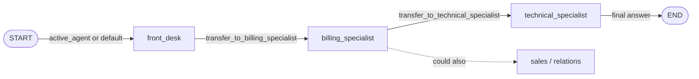

# 8. Swarm / network of peers (handoffs between agents)

> **TL;DR** Agents are peers. The active agent works and, when another peer is
> better suited, **hands off control** with a tool call. There is no
> coordinator, and the active agent is remembered across turns. It suits
> conversations where the "who" changes. It runs sequentially, every agent
> must know its peers, and there is a risk of handoff loops and context growth.

## How it works



- Every agent is a `create_agent` added **directly as a subgraph node** of one
  `StateGraph`. The nodes share the `messages` channel.
- A handoff tool returns
  `Command(goto="technical_specialist", graph=Command.PARENT, update={...})`.
  `graph=Command.PARENT` makes the jump happen in the swarm graph, not inside
  the agent.
- The update must include a `ToolMessage` answering the handoff call, which
  keeps the history valid. It also sets `active_agent`.
- `START` routes to `active_agent` (default `front_desk`). With a checkpointer,
  the next user turn resumes with the last active agent.
- An agent that answers without handing off ends the run.

The term *handoff* comes from OpenAI's Swarm and Agents SDK. The LangChain docs
now implement it by hand (the `langgraph-swarm` package still works but is no
longer referenced).

## Our implementation

`src/email_assistant/native/swarm.py`

```python
@tool(f"transfer_to_{target}", description=description)
def handoff(note: str, runtime: ToolRuntime) -> Command:
    tool_message = ToolMessage(content=f"Transferred to {target}. Note: {note}",
                               name=f"transfer_to_{target}", tool_call_id=runtime.tool_call_id)
    return Command(goto=target, graph=Command.PARENT,
                   update={"messages": [*runtime.state["messages"], tool_message], "active_agent": target})
```

Flow for E-1004: `front_desk`, then `billing_specialist` (lookups, correction
ticket), then `technical_specialist` (status, KB, ticket), which writes the
final `EmailResolution` covering both parts because it sees the billing work in
the shared history.

**Context engineering:** we forward the **full** history (as `langgraph-swarm`
does), so peers see each other's tool results. The alternative in the
LangChain docs forwards only the handoff `AIMessage` + `ToolMessage` and puts a
summary in the note. That keeps context lean, but the next agent knows only
what the note says. The library offers both (`history="full" | "handoff_only"`).

Measured: 4 calls for single-intent e-mails (front desk handoff + 3), 7 for
E-1004, and the **highest token use** for E-1004 (about 11k) because every
agent re-reads the growing shared history.

## Two ways to implement handoffs

| | Swarm: multiple agent subgraphs (this page) | [State machine](09-state-machine.md): single agent + middleware |
|---|---|---|
| Agents | separate graphs with their own prompts and tools | one agent with a config per step |
| Context | you decide what to forward | the history flows naturally |
| Use when | agents are bespoke graphs (reflection, retrieval, other teams) | most handoff cases (LangChain recommendation) |

## Strengths

- **Direct user interaction.** The specialist talks to the user itself, with
  no supervisor rephrasing. That is why LangChain's benchmark saw the swarm
  slightly outperform the supervisor.
- **Stateful.** Repeat requests skip routing: 5 vs. 8 calls over two turns in
  the LangChain docs' example.
- **Decentralized.** No coordinator bottleneck; adding a peer means updating
  the handoff lists.

## Weaknesses and failure modes

- **Sequential.** It cannot consult several specialists in parallel (7+ calls
  and about 14k tokens in LangChain's multi-domain example).
- **Handoff loops.** Agents can ping-pong. Microsoft lists "infinite handoff
  loops" and "unpredictable routing paths". Cap handoffs (the library's
  `max_handoffs`, and `SwarmAgent.max_activations` per agent).
- **Every agent must know its peers.** That makes it unsuitable for third-party agents.
- **Context growth** with full-history forwarding; **information loss** with
  note-only forwarding.
- **Parallel tool calls with a handoff** break the history pairing. Prompt
  agents to hand off alone, or handle it in the tool.

## When to use

- Customer-support-style conversations: triage, then a specialist, possibly
  moving between specialists, with the user talking to whoever is active.
- Multi-turn flows where continuity with the current specialist matters.
- When the specialists are genuinely different graphs owned by different teams.

## When not to use

- Batch or back-office processing (like our inbox): nobody is on the other end
  of the conversation, and a router or supervisor parallelizes better.
- Many domains per request.
- If a single agent that switches configuration suffices, use the
  [state machine](09-state-machine.md).

## Using the library

```python
from agentpatterns import SwarmAgent, create_swarm

swarm = create_swarm(
    model,
    [SwarmAgent("front_desk", "Routes new e-mails", FRONT_DESK, handoffs=["billing_specialist", ...]),
     SwarmAgent("billing_specialist", "Invoices, refunds", BILLING, tools=BILLING_TOOLS), ...],
    default_agent="front_desk",
    response_format=EmailResolution,
    history="full",          # or "handoff_only"
    max_handoffs=8,
    checkpointer=InMemorySaver(),
)
```

API: [library.md](../library.md#create_swarm).

## Sources

- LangChain docs, *Handoffs* (multi-agent) and the customer-support tutorial; LangGraph *Graph API* (`Command.PARENT`).
- OpenAI Agents SDK, *Handoffs* (`input_filter`, handoff history).
- LangChain blog, *Benchmarking multi-agent architectures* (swarm vs. supervisor).
- Microsoft, *Handoff orchestration* (loop risks).
