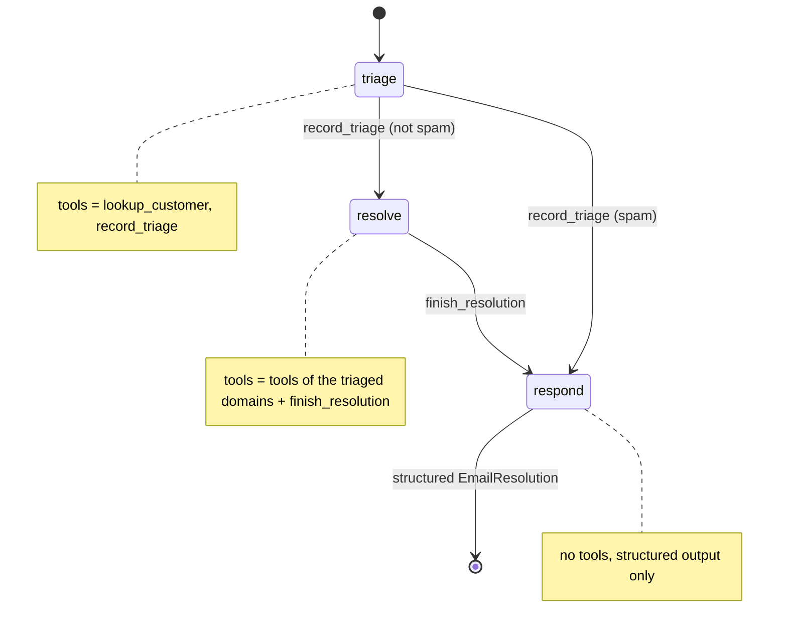

# 9. State machine: handoffs within a single agent

> **TL;DR** One agent moves through named steps. Each step has its own system
> prompt, tools and allowed transitions; tools switch the step by updating
> `current_step`, and middleware applies the step's configuration before every
> model call. The LangChain docs recommend this variant for most handoff use
> cases. It enforces order ("no refund before triage"), keeps the history
> natural, and needs a few extra calls for transitions.

## How it works



```python
@wrap_model_call
def apply_step_config(request, handler):
    step = request.state.get("current_step", "triage")
    ...
    return handler(request.override(system_message=SystemMessage(prompt), tools=tools,
                                    response_format=... if final step else None))
```

- **All** tools are registered with `create_agent` up front; the middleware
  only narrows them per step.
- Transition tools return
  `Command(update={"current_step": ..., "messages": [ToolMessage(...)]})`.
  The `ToolMessage` answers the tool call.
- Structured output (`response_format`) is offered only in the final step, so
  the agent cannot end early.
- With a checkpointer the step persists across conversation turns.

## Our implementation

`src/email_assistant/native/state_machine.py`

- `triage`: look up the customer, then `record_triage(category, ..., summary)`,
  which stores the triage in state (`triage`) and moves on.
- `resolve`: the prompt includes the triage via the template `{triage}`. The
  tools are **only those of the triaged domains**, so a sales e-mail cannot
  trigger `issue_refund`. `finish_resolution` then moves on.
- `respond`: no tools, returns `EmailResolution`.

Measured: 6 calls per e-mail (triage 2, resolve 3, respond 1), 3 for spam.
It never needs more calls for more intents, because tool calls within a step
run in parallel.

## Strengths

- **Enforced sequencing and least privilege.** Capabilities unlock only when
  preconditions are met. The docs' example is collecting warranty status
  before offering a repair.
- **Natural conversation.** One agent and one history, so no handoff context
  engineering and no invalid message sequences.
- **Direct user interaction and multi-turn continuity** (the step is state).
- **Simple.** One agent plus one middleware, instead of N graphs.

## Weaknesses and failure modes

- **Transition calls cost model turns** (record, finish).
- **The model can still pick the wrong transition**; allowed transitions per
  step limit the damage, and `Step(max_visits=...)` stops ping-pong between steps.
- **One shared context.** Every step sees everything before it, and long
  conversations need summarization.
- Too many steps turn it into a hand-coded workflow: then write the
  [pipeline](02-sequential-pipeline.md) explicitly.

## When to use

- Multi-stage conversations: collect data, verify, resolve, confirm. Support,
  onboarding, claims, order changes.
- When some tools must only be available after certain conditions (compliance, safety).
- As the default handoff implementation instead of a [swarm](08-swarm-handoffs.md).

## When not to use

- Specialists that are complex graphs of their own (use a swarm or a supervisor).
- Parallel multi-domain work (use a [supervisor](06-supervisor.md) or [router](03-router.md)).

## Using the library

The library packages the middleware as `StateMachineMiddleware`. It can be
dropped into any `create_agent`, or used via `create_state_machine_agent`:

```python
from agentpatterns import Step, create_state_machine_agent, transition

@tool
def record_triage(category: str, ..., runtime: ToolRuntime):
    """Record the triage and move on."""
    return transition("resolve", runtime.tool_call_id, triage={...})   # custom transition

agent = create_state_machine_agent(
    model,
    steps=[
        Step("triage", TRIAGE_PROMPT, tools=[lookup_customer, record_triage]),
        Step("resolve", "Triage: {triage}\n...", tools=domain_tools,
             transitions=["respond"],                    # auto-generated go_to_respond(reason)
             tool_filter=only_triaged_domains),
        Step("respond", RESPOND_PROMPT, final=True),
    ],
    response_format=EmailResolution,
    state_schema=CaseState,                               # adds the `triage` key
)
```

API: [library.md](../library.md#create_state_machine_agent).

## Sources

- LangChain docs, *Handoffs* ("single agent with middleware" recommended for
  most cases) and the customer-support tutorial; *Custom middleware* (`wrap_model_call`, `ModelRequest.override`).
- OpenAI, *A practical guide to building agents* (instruction templates, guardrails).
