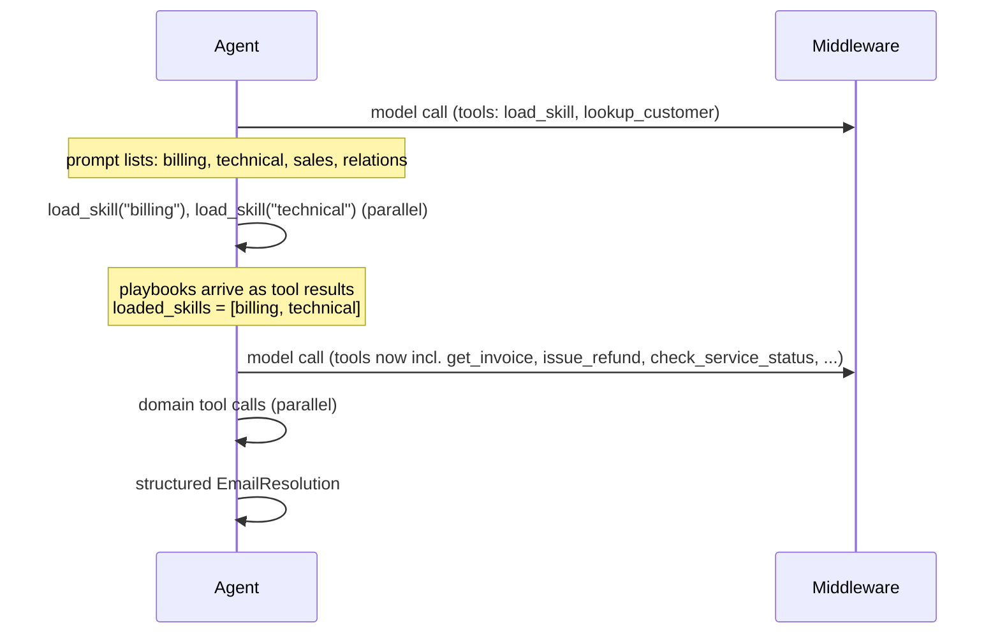

English | [Deutsch](../de/patterns/10-skills.md)

# 10. Skills (progressive disclosure)

> **TL;DR** One agent stays in control. Its prompt lists only skill *names and
> descriptions*. Calling `load_skill(name)` brings the full playbook into the
> context as a tool result and unlocks the skill's tools. Context stays small
> until a capability is needed, and teams can contribute skills independently.
> Loaded skills stay in the context for the rest of the conversation.

## How it works



- `load_skill` returns a `Command` that adds the playbook (`ToolMessage`) and
  appends the skill to `loaded_skills`.
- `loaded_skills` has a **merge reducer**, because two `load_skill` calls in
  one turn would otherwise conflict.
- A `wrap_model_call` middleware exposes the tools of loaded skills only
  (dynamic tool registration).
- This is the same idea as Anthropic's Agent Skills (metadata, then SKILL.md,
  then bundled files) and `llms.txt`.

## Our implementation

`src/email_assistant/native/skills.py`: four skills (billing, technical,
sales, relations), each with a playbook of policy steps and its domain tools.
`lookup_customer` is always available.

Measured: **4 calls for any e-mail**, including the two-intent E-1004 (load
both skills in parallel, then parallel reads, parallel actions, answer). That
ties the pipeline and is second only to the single agent.

## Strengths

- **Few model calls.** 3 in LangChain's one-shot example; stateful, so a repeat
  request costs 2 calls.
- **Small base prompt.** Only the catalog is loaded up front, which helps
  against "context rot" and tool overload.
- **Team distribution.** Skills are prompt and tool packages that different
  teams can own, version and review, much lighter than full subagents.
- **Direct user interaction.** It is still one conversational agent.
- **Extensible.** Hierarchical skills (skills that reveal sub-skills), and
  skills that reference files or scripts loaded later.

## Weaknesses and failure modes

- **Context accumulation.** After loading, every later call carries all loaded
  playbooks (about 15k vs. 9k tokens for subagents in LangChain's multi-domain
  example).
- **No context isolation** between domains; one agent mixes all tool results.
- **Relies on the model loading the right skill.** Descriptions are the routing
  signal, as with subagents.
- **No enforced constraints between skills.** Use the
  [state machine](09-state-machine.md) when order matters.

## When to use

- One agent with **many possible specializations**: coding assistants
  (languages, frameworks), knowledge assistants (domains), support desks with
  many product lines.
- When prompts are long but only a few are needed per request.
- When different teams contribute capabilities but you don't want the overhead of subagents.

## When not to use

- Large per-domain contexts that are all needed at once, where isolation
  matters: use a [supervisor](06-supervisor.md) or [router](03-router.md).
- Strict sequencing or permission rules: use a [state machine](09-state-machine.md).

## Using the library

`SkillsMiddleware` works with any `create_agent`; `create_skills_agent` is the shortcut:

```python
from agentpatterns import Skill, create_skills_agent

agent = create_skills_agent(
    model,
    [Skill("billing", "Invoices, refunds", instructions=BILLING_PLAYBOOK, tools=BILLING_TOOLS),
     Skill("technical", "Outages, bugs", instructions=TECH_PLAYBOOK, tools=TECH_TOOLS)],
    system_prompt=SKILLS_AGENT,
    tools=[lookup_customer],          # always available
    response_format=EmailResolution,
)
```

API: [library.md](../library.md#create_skills_agent).

## Sources

- LangChain docs, *Skills* (multi-agent) and the SQL assistant tutorial; the
  multi-agent overview's performance tables.
- Anthropic, *Equipping agents for the real world with Agent Skills* (2025).
- Jeremy Howard, llms.txt.
