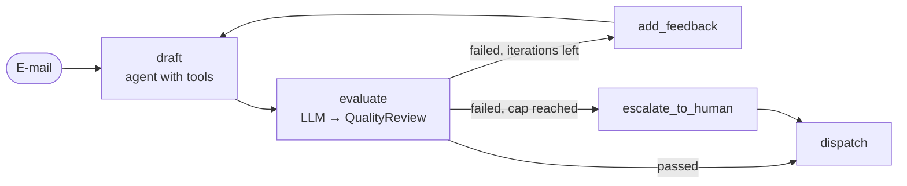

# 11. Evaluator-optimizer (reflection loop)

> **TL;DR** A generator produces a candidate, an evaluator grades it against
> explicit criteria with structured output, and failing candidates go back to
> the generator together with the feedback. It repeats until the candidate
> passes or an iteration cap is reached. This raises quality when criteria are
> clear and checkable. It multiplies cost and latency, and it needs a cap and a
> fallback.

## How it works



- The evaluator returns `QualityReview(passed, score, issues, feedback)`
  through `with_structured_output`.
- The feedback is appended as a `HumanMessage` to the **generator's own
  conversation**. The drafter keeps its tool results, so a revision costs one
  call instead of redoing the research.
- A hard cap (`MAX_ITERATIONS = 3`) and a safe fallback (escalate to a human,
  never send a failed draft).

Microsoft calls this *maker-checker*, "also known as evaluator-optimizer,
generator-verifier, critic loops, or reflection loops".

## Our implementation

`src/email_assistant/native/evaluator_optimizer.py`

The reviewer checks the house rules: customer addressed by first name, every
reference number (refund, ticket, lead, escalation) mentioned, an apology for
frustrated customers, the signature, no internal information (tier), and never
a confirmed data deletion.

To exercise the loop, the mock drafter writes a hasty first draft ("Hi, we
have looked into your request ..."). The reviewer rejects it with concrete
issues; the second draft passes:

```
iteration 1: failed - Address the customer by name (Anna). Mention the reference number(s) RF-2158 ...
iteration 2: passed
```

Measured: 6 calls (3 draft + 1 review + 1 revision + 1 review); spam 2.

## Strengths

- **Quality where criteria are explicit.** Self-Refine reports about 20%
  absolute improvement; Reflexion reached 91% pass@1 on HumanEval. Cognition's
  2026 report finds review loops catch about 2 bugs per PR, about 58% of them severe.
- **Separation of generation and verification.** The judge can be a different,
  cheaper model, or even code (tests, schema validation, a policy engine).
  Cognition found reviewers work best **without** sharing the generator's context.
- **Built-in quality gate.** Combined with a fallback, bad outputs never reach the customer.

## Weaknesses and failure modes

- **Non-convergence.** The loop oscillates or never satisfies a vague rubric.
  Always cap it and define a fallback.
- **Lenient or sycophantic judges** approve bad output; overly strict ones burn
  budget. Calibrate the judge on labeled examples.
- **Cost ≈ k × (generate + evaluate)**, plus latency per iteration.
- **Vague criteria produce vague feedback.** Make rubrics concrete and checkable.

## When to use

- Clear, checkable criteria: style and policy rules, format, translation
  fidelity, code that has to pass tests, legal wording.
- High-stakes outputs where a second look is cheaper than a mistake.
- Around any other pattern: in our composite, the router is the generator.

## When not to use

- No meaningful criteria (subjective taste): you pay for noise.
- Latency-critical interactions.
- When a deterministic validator suffices; use a gate in a
  [pipeline](02-sequential-pipeline.md) instead.

## Using the library

```python
from agentpatterns import create_evaluator_optimizer

loop = create_evaluator_optimizer(
    drafter,                           # generator: any agent-contract runnable (agent, router, supervisor, ...)
    model,                             # evaluator: a chat model (can be cheaper) or an agent with tools
    evaluator_prompt=REVIEWER,
    evaluation_schema=QualityReview,   # needs a boolean `passed` (or pass `passed=`)
    max_iterations=3,
    on_max_iterations=lambda draft, review: escalate(draft, review),
)
```

The output includes `structured_response`, `evaluation` and `iterations`. API:
[library.md](../library.md#create_evaluator_optimizer).

When the generator is itself a pattern (for example an orchestrator with
researcher subagents), its work lives outside `messages`. Pass
`carry_over=["results"]` so revisions build on the earlier research instead of
redoing it, and `evaluator_context=` so the reviewer sees the evidence. See the
[research-with-review recipe](../library.md#recipe-research-with-review).

## Sources

- Anthropic, *Building effective agents* (evaluator-optimizer).
- LangGraph docs, *Workflows and agents* (evaluator-optimizer example).
- Microsoft, *Maker-checker* (iteration caps, fallbacks).
- Madaan et al., *Self-Refine* (2023); Shinn et al., *Reflexion* (2023);
  Cognition, *Multi-agents: what's actually working* (2026).
